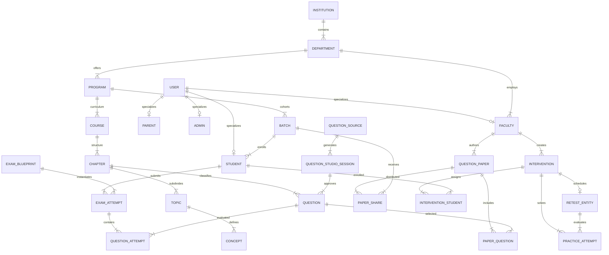

# 04 — DATA MODELS & DATABASE MAPPING SPECIFICATION

**Project:** MediXO EduX (`medixo-edux-platform` v1.0.0)
**Phase:** C — Data Model & Database Mapping Specification
**Date:** 2026-08-23 · **Branch:** `arena/01a02f45-edux`
**Status:** Complete & Verified Canonical Data Model Specification

---

## TABLE OF CONTENTS
1. [Executive Summary & Core Data Principles](#1-executive-summary--core-data-principles)
2. [Entity Persistence Classification Taxonomy](#2-entity-persistence-classification-taxonomy)
3. [Master Entity Catalog (All Discovered Entities)](#3-master-entity-catalog)
4. [Core Identity Models (User, Student, Faculty, Admin, Parent)](#4-core-identity-models)
5. [Institution & Academic Hierarchy](#5-institution--academic-hierarchy)
6. [Batch Model & Student Cohorts](#6-batch-model--student-cohorts)
7. [University / JEE / NEET Canonical Context & Isolation Invariants](#7-university--jee--neet-canonical-context)
8. [Course, Subject, Chapter, Topic, and Concept Hierarchy](#8-course-subject-chapter-topic-and-concept-hierarchy)
9. [Universal Question Data Model & Question Types](#9-universal-question-data-model--question-types)
10. [Question Source Model & Provenance](#10-question-source-model--provenance)
11. [Book, PDF & NCERT Source Document Ingestion Flow](#11-book-pdf--ncert-source-document-ingestion-flow)
12. [Exam Definition, Question Paper, and Exam Attempt Triad](#12-exam-definition-question-paper-and-exam-attempt-triad)
13. [Question Paper & Paper Library Data Model](#13-question-paper--paper-library-data-model)
14. [Paper Share & Audience Distribution Model](#14-paper-share--audience-distribution-model)
15. [Question Attempt Data Model & Telemetry](#15-question-attempt-data-model--telemetry)
16. [Exam Agent Data Model & Live Exam State](#16-exam-agent-data-model--live-exam-state)
17. [Student 360 Data Model (Stored vs Derived Breakdown)](#17-student-360-data-model)
18. [Academic DNA Data Model (Evidence Pools & Trends)](#18-academic-dna-data-model)
19. [Similar Issues Clustering Model](#19-similar-issues-clustering-model)
20. [Intervention Data Model & Remediation Lifecycle](#20-intervention-data-model--remediation-lifecycle)
21. [Practice Attempt Model (Separation from Official Exams)](#21-practice-attempt-model)
22. [Diagnostic Re-test Model](#22-diagnostic-re-test-model)
23. [Effectiveness Calculation Model](#23-effectiveness-calculation-model)
24. [Notification Model](#24-notification-model)
25. [File & Document Metadata Model](#25-file--document-metadata-model)
26. [Comprehensive Mermaid Entity-Relationship Diagram](#26-comprehensive-mermaid-entity-relationship-diagram)
27. [Identifier Strategy (UUIDs, Prefixed Strings, Semantic Keys)](#27-identifier-strategy)
28. [Timestamp Strategy & Monotonicity Rules](#28-timestamp-strategy--monotonicity-rules)
29. [Complete Enum & Status Inventory Table](#29-complete-enum--status-inventory-table)
30. [Query Patterns Catalogue](#30-query-patterns-catalogue)
31. [Future Indexing Candidates](#31-future-indexing-candidates)
32. [Data Ownership Matrix (Current vs Future Owner)](#32-data-ownership-matrix)
33. [Database Design Warnings (Things the Backend Must NOT Do)](#33-database-design-warnings)
34. [Python / PostgreSQL Conceptual Architecture Mapping](#34-python--postgresql-conceptual-architecture-mapping)
35. [Database Normalization Observations](#35-database-normalization-observations)
36. [Critical Database Entities (Top 20 Priority Table)](#36-critical-database-entities)
37. [API ↔ Data Model Mismatches Table](#37-api--data-model-mismatches-table)
38. [Intelligence ↔ Data Model Ownership Cross-Check](#38-intelligence--data-model-ownership-cross-check)

---

## 1. EXECUTIVE SUMMARY & CORE DATA PRINCIPLES

This specification establishes the authoritative Data Model and Database Mapping for the MediXO EduX platform. It bridges the Phase B API contracts with the future Python/PostgreSQL relational architecture.

### Core Principles
1. **Frontend as Source of Truth:** Every entity, field, type, and relationship documented here is verified from the active frontend codebase (`src/api/`, `src/services/`, `src/intelligence/`, `src/datasets/`). No generic LMS concepts have been fabricated.
2. **Strict Entity Classification:** Not every UI object or composite API response becomes a database table. Composite snapshots (e.g. Student 360, Academic DNA) remain **derived intelligence**, calculated on-demand from canonical source records (`ExamAttempt`, `QuestionAttempt`).
3. **University / JEE / NEET Domain Isolation:** The three academic tracks (`University`, `JEE`, `NEET`) are strictly separated by explicit context flags (`domain` and `examFamily`). Syllabi, attempts, and question pools must never pollute across domains.
4. **Official Assessment vs. Remedial Practice Separation:** Official examination attempts (`ExamAttempt`) feed official transcripts, GPA, and class rankings; remedial practice attempts (`PracticeAttempt`) feed intervention recovery metrics and are strictly partitioned.

---

## 2. ENTITY PERSISTENCE CLASSIFICATION TAXONOMY

Every discovered data structure in the platform is classified into one of 9 distinct persistence tiers:

| Tier | Classification | Description | Future Backend Storage / Compute | Example Entities |
|---|---|---|---|---|
| **A** | **Persistent Database Entity** | Core transactional business records requiring ACID relational storage | PostgreSQL primary tables with foreign keys and indexes | `User`, `Student`, `Faculty`, `Batch`, `ExamAttempt`, `Question`, `Intervention` |
| **B** | **Derived Intelligence** | Algorithmic outputs dynamically computed from underlying records | Python intelligence service (cached via Redis or computed on request) | `Student 360`, `Academic DNA`, `Similar Issues Group`, `Effectiveness` |
| **C** | **Reference / Catalog Data** | Curated reference datasets, taxonomies, and options | PostgreSQL lookup tables or static seed catalogs | `REGISTRATION_OPTIONS`, `DEPARTMENTS`, `Programs`, `Subjects` |
| **D** | **User / Session Data** | Authentication tokens, session state, and security context | Redis token cache / stateless JWT payload | `AccessToken`, `RefreshToken`, `SessionContext` |
| **E** | **Event / History Data** | Append-only audit logs, interaction telemetry, and analytics events | PostgreSQL audit tables / Time-series / JSONB logs | `AuditLog`, `QuestionAttempt.interactions`, `aiStudioHistory` |
| **F** | **AI-Generated Data** | Outputs generated by LLM reasoning or heuristic engines | PostgreSQL chat/artifact tables + Vector DB embeddings | `ChatThread`, `ChatMessage`, `SavedLessonPlan`, `AITutorReply` |
| **G** | **File / Document Metadata** | File descriptor records referencing binary blobs | PostgreSQL metadata tables + S3/Blob storage | `QuestionStudioSource`, `FacultyReport` (PDF blob), `AdmitCard` |
| **H** | **Temporary / Prototype Data** | In-browser mock shims and test fixtures | Discarded in production / Isolated to test fixtures | `examAttemptSeeds`, `DEMO_USERS` password bypass |
| **I** | **Frontend Presentation State** | Ephemeral UI state (tab selection, filter toggles, dialog open) | React component state / URL query parameters | Active tab index, expanded accordion state, search query string |

---

## 3. MASTER ENTITY CATALOG

Below is the exhaustive catalog of all 32 major data entities discovered across the platform codebase, formatted with complete field definitions, relational constraints, and backend ownership mappings:

### Entity: User

**Purpose:** Core user identity and authentication account across student, faculty, admin, and parent roles.
**Current Frontend Source:** `src/datasets/platform/users.js, src/contexts/auth-context.jsx, src/api/auth/session.js`
**Persistence Classification:** `A. Persistent database entity`
**Identifier:** `id (string / UUID)`

**Fields:**

| Field | Type | Required | Nullable | Current Source | Notes |
|---|---|---|---|---|---|
| `id` | `string` | Yes | No | `users.js / session.js` | Unique user ID (e.g. 'u1', 'u_stu_001', 'u_stu_1724425200000') |
| `email` | `string (email)` | Yes | No | `session.js` | Unique normalized email address for login and notifications |
| `password` | `string (hash)` | Yes | No | `auth-context.jsx` | Password (plaintext 'aurora123' in prototype; bcrypt hash in backend) |
| `role` | `string (enum)` | Yes | No | `config/index.js` | 'student' | 'faculty' | 'admin' | 'parent' |
| `name` | `string` | Yes | No | `users.js` | Full user name (e.g. 'Dr. Sarah Jenkins', 'Aarav Sharma') |
| `firstName` | `string` | No | Yes | `auth-context.jsx` | Derived first name for greetings |
| `phone` | `string` | No | Yes | `session.js` | Normalized phone number (e.g. '9876543210') |
| `category` | `string` | No | Yes | `registration.js` | Student category ('General', 'OBC-NCL', 'SC', 'ST', 'EWS') |
| `verified` | `boolean` | Yes | No | `session.js` | Whether account OTP / email verification has succeeded |
| `avatar` | `string (url)` | No | Yes | `users.js` | URL to user profile avatar image |
| `status` | `string` | No | Yes | `users.js` | Account status ('Active' | 'Suspended') |
| `createdAt` | `string (ISO)` | Yes | No | `session.js` | Account creation timestamp |

**Relationships:** 1:1 with Student (if role='student'), 1:1 with Faculty (if role='faculty'), 1:1 with Parent (if role='parent').
**Current Consumers:** AuthContext, Login, Register, MyStudents, Users admin page, Header profile widgets.
**Future Backend Ownership:** PostgreSQL 'users' table.
**Validation / Invariants:** Unique email constraint; valid role; password must be securely hashed.
**Migration Notes:** Hash plaintext passwords; unify demo IDs with UUIDv4.

---

### Entity: Student

**Purpose:** Academic student profile containing institutional enrollment, curriculum progress, and competitive exam targets.
**Current Frontend Source:** `src/intelligence/master-profile.js, src/intelligence/faculty/datasets/students-directory.js`
**Persistence Classification:** `A. Persistent database entity`
**Identifier:** `id (string / UUID, FK to User.id)`

**Fields:**

| Field | Type | Required | Nullable | Current Source | Notes |
|---|---|---|---|---|---|
| `id` | `string` | Yes | No | `master-profile.js` | Unique student identifier (matches User.id) |
| `roll` | `string` | Yes | No | `master-profile.js` | Academic roll number (e.g. '2024CS1001') |
| `enrollmentNumber` | `string` | No | Yes | `master-profile.js` | Official university enrollment number (e.g. 'MIT2024CS001') |
| `institution` | `string` | Yes | No | `master-profile.js` | Institution name ('Meridian Institute of Technology') |
| `department` | `string` | Yes | No | `master-profile.js` | Department name ('Computer Science & Engineering') |
| `program` | `string` | Yes | No | `master-profile.js` | Degree program ('B.Tech CSE') |
| `semester` | `number` | Yes | No | `master-profile.js` | Current academic semester (1-8) |
| `batchId` | `string` | Yes | No | `students-directory.js` | FK to Batch cohort (e.g. 'batch_cse_2024') |
| `batch` | `string` | No | Yes | `students-directory.js` | Batch badge name (e.g. 'CSE 2024-A') |
| `cgpa` | `number` | No | Yes | `master-profile.js` | Cumulative Grade Point Average (0.00 - 10.00, e.g. 8.84) |
| `rank` | `number` | No | Yes | `master-profile.js` | Class academic rank (e.g. 4) |
| `attendance` | `number` | No | Yes | `master-profile.js` | Overall class attendance percentage (e.g. 92.4) |
| `examFamily` | `string` | No | Yes | `students-directory.js` | Competitive stream if enrolled ('JEE' | 'NEET' | null) |
| `competitiveTargets` | `array[object]` | No | Yes | `master-profile.js` | Array of competitive exam target objects [{exam, targetYear, targetPercentile}] |

**Relationships:** FK to User; FK to Batch; 1:N with ExamAttempt; 1:N with Intervention (junction).
**Current Consumers:** StudentProfile, MyStudents, Dashboard, Student 360, Exam Agent.
**Future Backend Ownership:** PostgreSQL 'students' table.
**Validation / Invariants:** CGPA between 0 and 10; semester between 1 and 8; valid FK to batch.
**Migration Notes:** Resolve string department and program names to foreign keys.

---

### Entity: Faculty

**Purpose:** Faculty academic profile containing departmental affiliation, teaching schedule, and assigned courses.
**Current Frontend Source:** `src/intelligence/faculty/master-profile.js, src/datasets/platform/users.js`
**Persistence Classification:** `A. Persistent database entity`
**Identifier:** `id (string / UUID, FK to User.id)`

**Fields:**

| Field | Type | Required | Nullable | Current Source | Notes |
|---|---|---|---|---|---|
| `id` | `string` | Yes | No | `users.js` | Faculty ID (e.g. 'fac-1', 'u2') |
| `name` | `string` | Yes | No | `users.js` | Full faculty name (e.g. 'Dr. Meera Krishnan') |
| `department` | `string` | Yes | No | `users.js` | Department name ('Computer Science & Engineering') |
| `designation` | `string` | Yes | No | `users.js` | Academic rank ('Professor', 'Associate Professor') |
| `email` | `string` | Yes | No | `users.js` | Faculty institutional email |
| `assignedCourses` | `array[string]` | No | Yes | `master-profile.js` | List of course codes taught (e.g. ['CS501', 'CS503']) |
| `cabin` | `string` | No | Yes | `master-profile.js` | Office room location (e.g. 'Room 304') |
| `officeHours` | `string` | No | Yes | `master-profile.js` | Weekly office hours string |

**Relationships:** FK to User; 1:N with Course; 1:N with QuestionPaper; 1:N with Intervention.
**Current Consumers:** Faculty Dashboard, TeachingWorkspace, MyStudents, PaperGenerator.
**Future Backend Ownership:** PostgreSQL 'faculty' table.
**Validation / Invariants:** Must link to valid User record with role='faculty'.
**Migration Notes:** Map assignedCourses to relational course_faculty junction table.

---

### Entity: Admin

**Purpose:** Institutional administrator profile managing governance, roles, permissions, and institution intelligence.
**Current Frontend Source:** `src/datasets/platform/users.js, src/intelligence/admin/master-profile.js`
**Persistence Classification:** `A. Persistent database entity`
**Identifier:** `id (string / UUID, FK to User.id)`

**Fields:**

| Field | Type | Required | Nullable | Current Source | Notes |
|---|---|---|---|---|---|
| `id` | `string` | Yes | No | `users.js` | Admin ID (e.g. 'u3') |
| `name` | `string` | Yes | No | `users.js` | Administrator name (e.g. 'Dr. Sarah Jenkins') |
| `title` | `string` | Yes | No | `master-profile.js` | Administrative title ('Dean of Academic Affairs') |
| `department` | `string` | No | Yes | `users.js` | Department ('Administration') |
| `permissions` | `array[string]` | No | Yes | `admin/core.js` | Assigned administrative permission flags |

**Relationships:** FK to User with role='admin'.
**Current Consumers:** Admin Dashboard, InstitutionIntelligence, Roles & Permissions, AuditLogs.
**Future Backend Ownership:** PostgreSQL 'admin_profiles' table.
**Validation / Invariants:** Must hold role='admin'.
**Migration Notes:** Enforce backend RBAC permissions table.

---

### Entity: Parent

**Purpose:** Parent/Guardian profile linked to student wards for progress tracking (portal currently feature-gated).
**Current Frontend Source:** `src/datasets/parent/core.js, src/datasets/parent/portal.js`
**Persistence Classification:** `A. Persistent database entity`
**Identifier:** `id (string / UUID, FK to User.id)`

**Fields:**

| Field | Type | Required | Nullable | Current Source | Notes |
|---|---|---|---|---|---|
| `id` | `string` | Yes | No | `parent/core.js` | Parent ID (e.g. 'p1', 'u4') |
| `name` | `string` | Yes | No | `parent/core.js` | Parent name (e.g. 'Rajesh Sharma') |
| `email` | `string` | Yes | No | `parent/core.js` | Parent email |
| `phone` | `string` | Yes | No | `parent/core.js` | Parent mobile phone number |
| `relationship` | `string` | Yes | No | `parent/core.js` | Relationship to ward ('Father', 'Mother', 'Guardian') |
| `linkedStudentIds` | `array[string]` | Yes | No | `parent/core.js` | Array of student ward IDs (e.g. ['u_stu_001']) |

**Relationships:** FK to User; N:M junction with Student (`parent_students` table).
**Current Consumers:** Parent Portal (when FEATURE_FLAGS.parentPortal is enabled).
**Future Backend Ownership:** PostgreSQL 'parents' + 'parent_students' junction table.
**Validation / Invariants:** Must hold role='parent'; valid student IDs.
**Migration Notes:** Normalize linkedStudentIds array into relational junction table.

---

### Entity: Institution

**Purpose:** Top-level higher education institution entity.
**Current Frontend Source:** `src/intelligence/admin/datasets/institutions.js, src/config/index.js`
**Persistence Classification:** `C. Reference / catalog data`
**Identifier:** `id (string)`

**Fields:**

| Field | Type | Required | Nullable | Current Source | Notes |
|---|---|---|---|---|---|
| `id` | `string` | Yes | No | `institutions.js` | Institution ID (e.g. 'inst-meridian') |
| `name` | `string` | Yes | No | `institutions.js` | Name ('Meridian Institute of Technology') |
| `code` | `string` | Yes | No | `institutions.js` | Short code ('MIT') |
| `campuses` | `array[string]` | No | Yes | `institutions.js` | Campus locations (e.g. ['Main Campus', 'North Campus']) |
| `academicYear` | `string` | Yes | No | `admin/core.js` | Active academic year ('2026-2027') |

**Relationships:** 1:N with Department; 1:N with Student.
**Current Consumers:** InstitutionIntelligence, Admin Settings, Header branding.
**Future Backend Ownership:** PostgreSQL 'institutions' table.
**Validation / Invariants:** Unique institution name/code.
**Migration Notes:** Single-tenant configuration initially; schema supports multi-institution.

---

### Entity: Department

**Purpose:** Academic department within the institution (e.g. Computer Science, Mechanical).
**Current Frontend Source:** `src/datasets/platform/users.js, src/intelligence/admin/datasets/institutions.js`
**Persistence Classification:** `A. Persistent database entity`
**Identifier:** `id / code (string)`

**Fields:**

| Field | Type | Required | Nullable | Current Source | Notes |
|---|---|---|---|---|---|
| `id` | `string` | Yes | No | `users.js` | Department ID (e.g. 'dept-cse') |
| `name` | `string` | Yes | No | `users.js` | Full name ('Computer Science & Engineering') |
| `code` | `string` | Yes | No | `users.js` | Short code ('CSE') |
| `head` | `string` | No | Yes | `users.js` | Department Head name ('Dr. Sarah Jenkins') |
| `facultyCount` | `number` | No | Yes | `users.js` | Total faculty members count (e.g. 24) |
| `studentCount` | `number` | No | Yes | `users.js` | Total enrolled students count (e.g. 480) |

**Relationships:** 1:N with Program; 1:N with Faculty; 1:N with Student.
**Current Consumers:** Admin Departments, Faculty directory, MyStudents, InstitutionIntelligence.
**Future Backend Ownership:** PostgreSQL 'departments' table.
**Validation / Invariants:** Unique department code.
**Migration Notes:** Reference table for faculty and student academic affiliation.

---

### Entity: Program

**Purpose:** Academic degree program offering (e.g. B.Tech in CSE).
**Current Frontend Source:** `src/datasets/admin/operations.js, src/datasets/student/portal.js`
**Persistence Classification:** `A. Persistent database entity`
**Identifier:** `id (string)`

**Fields:**

| Field | Type | Required | Nullable | Current Source | Notes |
|---|---|---|---|---|---|
| `id` | `string` | Yes | No | `operations.js` | Program ID (e.g. 'prog-1') |
| `title` | `string` | Yes | No | `operations.js` | Title ('B.Tech in Computer Science & Engineering') |
| `degree` | `string` | Yes | No | `operations.js` | Degree award ('B.Tech') |
| `departmentId` | `string` | Yes | No | `operations.js` | FK to Department |
| `duration` | `string` | Yes | No | `operations.js` | Duration string ('4 Years') |
| `totalCredits` | `number` | Yes | No | `portal.js` | Total degree credits (e.g. 160) |
| `intake` | `number` | No | Yes | `operations.js` | Annual intake capacity (e.g. 120) |

**Relationships:** FK to Department; 1:N with Batch; 1:N with Course.
**Current Consumers:** Admin Programs, Student Programs view.
**Future Backend Ownership:** PostgreSQL 'programs' table.
**Validation / Invariants:** Duration >= 1; credits > 0.
**Migration Notes:** Program curriculum defines degree requirements.

---

### Entity: Batch

**Purpose:** Student cohort group belonging to a program, academic year, and section.
**Current Frontend Source:** `src/datasets/admin/operations.js, src/intelligence/faculty/datasets/students-directory.js`
**Persistence Classification:** `A. Persistent database entity`
**Identifier:** `id (string)`

**Fields:**

| Field | Type | Required | Nullable | Current Source | Notes |
|---|---|---|---|---|---|
| `id` | `string` | Yes | No | `students-directory.js` | Batch ID (e.g. 'batch_cse_2024') |
| `name` | `string` | Yes | No | `students-directory.js` | Batch display name ('CSE 2024-A') |
| `programId` | `string` | Yes | No | `operations.js` | FK to Program |
| `program` | `string` | Yes | No | `students-directory.js` | Program label ('B.Tech CSE') |
| `year` | `number` | Yes | No | `operations.js` | Cohort year level (e.g. 3) |
| `graduationYear` | `number` | No | Yes | `operations.js` | Graduation year (e.g. 2026) |
| `section` | `string` | No | Yes | `students-directory.js` | Class section code ('A') |
| `examFamily` | `string` | No | Yes | `students-directory.js` | Competitive track ('JEE' | 'NEET' | null) |
| `studentCount` | `number` | No | Yes | `operations.js` | Enrolled student count (e.g. 64) |

**Relationships:** FK to Program; 1:N with Student; 1:N with Intervention.
**Current Consumers:** MyStudents, Faculty Dashboard, Batches admin page, PaperGenerator sharing.
**Future Backend Ownership:** PostgreSQL 'batches' table.
**Validation / Invariants:** Batch membership groups students for cohort analytics.
**Migration Notes:** Batch membership is 1:N for students in current implementation.

---

### Entity: Course

**Purpose:** Curriculum course / subject unit offered within a program (e.g. CS501 Data Structures).
**Current Frontend Source:** `src/datasets/admin/core.js, src/datasets/faculty/workspace.js`
**Persistence Classification:** `A. Persistent database entity`
**Identifier:** `code (string, e.g. 'CS501')`

**Fields:**

| Field | Type | Required | Nullable | Current Source | Notes |
|---|---|---|---|---|---|
| `code` | `string` | Yes | No | `admin/core.js` | Unique course code (e.g. 'CS501', 'CS502', 'CS503') |
| `title` | `string` | Yes | No | `admin/core.js` | Course title ('Data Structures & Algorithms') |
| `departmentId` | `string` | Yes | No | `admin/core.js` | FK to Department ('CSE') |
| `credits` | `number` | Yes | No | `admin/core.js` | Course credit value (e.g. 4) |
| `semester` | `number` | Yes | No | `admin/core.js` | Recommended semester (1-8) |
| `facultyId` | `string` | No | Yes | `workspace.js` | FK to primary instructor |

**Relationships:** FK to Department; 1:N with Subject/Chapter; 1:N with Question.
**Current Consumers:** Faculty Courses, Admin Courses, Student Academics.
**Future Backend Ownership:** PostgreSQL 'courses' table.
**Validation / Invariants:** Unique course code.
**Migration Notes:** Course maps to Subject entity in University domain.

---

### Entity: Subject

**Purpose:** Academic subject classification across University and Competitive domains.
**Current Frontend Source:** `src/intelligence/faculty/datasets/competitive-questions.js, src/datasets/admin/operations.js`
**Persistence Classification:** `A. Persistent database entity`
**Identifier:** `name / code (string)`

**Fields:**

| Field | Type | Required | Nullable | Current Source | Notes |
|---|---|---|---|---|---|
| `name` | `string` | Yes | No | `competitive-questions.js` | Subject name ('Physics', 'Chemistry', 'Mathematics', 'Biology', 'Data Structures') |
| `domain` | `string` | Yes | No | `competitive-questions.js` | 'University' | 'Competitive' |
| `examFamily` | `string` | No | Yes | `competitive-questions.js` | 'JEE' | 'NEET' | null |
| `subjectCode` | `string` | No | Yes | `operations.js` | Course code alias (e.g. 'CS501') |

**Relationships:** 1:N with Chapter; 1:N with Question.
**Current Consumers:** Question Bank, PYQ Analysis, Student 360, Similar Issues.
**Future Backend Ownership:** PostgreSQL 'subjects' table.
**Validation / Invariants:** JEE subjects: Physics, Chemistry, Mathematics; NEET subjects: Physics, Chemistry, Biology; University: CS501-CS506.
**Migration Notes:** Subject name alone does not define domain; domain + examFamily are composite qualifiers.

---

### Entity: Chapter

**Purpose:** Curriculum chapter within a subject (e.g. Binary Search Trees, Kinematics, Biomolecules).
**Current Frontend Source:** `src/intelligence/faculty/datasets/competitive-questions.js, src/intelligence/faculty/datasets/question-studio-sources.js`
**Persistence Classification:** `A. Persistent database entity`
**Identifier:** `name (string, scoped by Subject)`

**Fields:**

| Field | Type | Required | Nullable | Current Source | Notes |
|---|---|---|---|---|---|
| `id` | `string / UUID` | Yes | No | `Schema design` | Chapter ID |
| `subjectId` | `string` | Yes | No | `competitive-questions.js` | FK to Subject |
| `name` | `string` | Yes | No | `competitive-questions.js` | Chapter name (e.g. 'Binary Search Trees', 'Kinematics') |
| `domain` | `string` | Yes | No | `competitive-questions.js` | 'University' | 'Competitive' |
| `examFamily` | `string` | No | Yes | `competitive-questions.js` | 'JEE' | 'NEET' | null |

**Relationships:** FK to Subject; 1:N with Topic; 1:N with Question; 1:N with SimilarIssue.
**Current Consumers:** Similar Issues clustering, Student 360 Weaknesses, Question Bank, Question Studio.
**Future Backend Ownership:** PostgreSQL 'chapters' table.
**Validation / Invariants:** Chapter name is scoped to Subject and Exam Domain.
**Migration Notes:** Add explicit UUID primary key in database.

---

### Entity: Topic

**Purpose:** Specific curriculum topic within a chapter (e.g. AVL Rotations, Projectile Motion).
**Current Frontend Source:** `src/intelligence/faculty/datasets/competitive-questions.js, src/intelligence/datasets/dna.js`
**Persistence Classification:** `A. Persistent database entity`
**Identifier:** `name (string, scoped by Chapter)`

**Fields:**

| Field | Type | Required | Nullable | Current Source | Notes |
|---|---|---|---|---|---|
| `id` | `string / UUID` | Yes | No | `Schema design` | Topic ID |
| `chapterId` | `string` | Yes | No | `competitive-questions.js` | FK to Chapter |
| `name` | `string` | Yes | No | `competitive-questions.js` | Topic name (e.g. 'AVL Rotations', 'Projectile Motion') |
| `importance` | `string` | No | Yes | `dna.js` | Yield rating ('High', 'Medium', 'Low') |

**Relationships:** FK to Chapter; 1:N with Concept; 1:N with Question.
**Current Consumers:** Academic DNA, Question Intelligence, PYQ Patterns.
**Future Backend Ownership:** PostgreSQL 'topics' table.
**Validation / Invariants:** Scoped to Chapter.
**Migration Notes:** Primary level for Academic DNA granular mastery tracking.

---

### Entity: Concept

**Purpose:** Granular concept tested by a question or lesson plan (e.g. Double Rotations, Range Equation).
**Current Frontend Source:** `src/intelligence/faculty/datasets/question-studio-questions.js, src/datasets/student/mentor.js`
**Persistence Classification:** `C. Reference / catalog data`
**Identifier:** `name (string)`

**Fields:**

| Field | Type | Required | Nullable | Current Source | Notes |
|---|---|---|---|---|---|
| `id` | `string / UUID` | Yes | No | `Schema design` | Concept ID |
| `topicId` | `string` | No | Yes | `question-studio.js` | FK to Topic |
| `name` | `string` | Yes | No | `question-studio.js` | Concept name (e.g. 'Double Rotations') |
| `description` | `string` | No | Yes | `mentor.js` | Pedagogical definition |

**Relationships:** FK to Topic; 1:N with Question.
**Current Consumers:** Question Studio, MediXO Mentor concepts, PYQ recurring patterns.
**Future Backend Ownership:** PostgreSQL 'concepts' table.
**Validation / Invariants:** None.
**Migration Notes:** Nullable topic FK as some concepts span multiple topics.

---

### Entity: Question

**Purpose:** Universal question model across Question Bank, PYQs, Competitive Questions, and Question Studio.
**Current Frontend Source:** `src/intelligence/faculty/datasets/competitive-questions.js, src/datasets/faculty/workspace.js`
**Persistence Classification:** `A. Persistent database entity`
**Identifier:** `questionId / id (string)`

**Fields:**

| Field | Type | Required | Nullable | Current Source | Notes |
|---|---|---|---|---|---|
| `id` | `string` | Yes | No | `competitive-questions.js` | Question ID (e.g. 'q_jee_phy_001', 'qb-101') |
| `domain` | `string` | Yes | No | `competitive-questions.js` | 'University' | 'Competitive' |
| `examFamily` | `string` | No | Yes | `competitive-questions.js` | 'JEE' | 'NEET' | null |
| `exam` | `string` | No | Yes | `competitive-questions.js` | Exam title (e.g. 'JEE Main', 'NEET UG', 'University') |
| `subject` | `string` | Yes | No | `competitive-questions.js` | Subject name or course code |
| `chapter` | `string` | Yes | No | `competitive-questions.js` | Chapter name |
| `topic` | `string` | No | Yes | `competitive-questions.js` | Topic name |
| `concept` | `string` | No | Yes | `competitive-questions.js` | Tested concept |
| `difficulty` | `string` | Yes | No | `competitive-questions.js` | 'Easy' | 'Medium' | 'Hard' |
| `questionType` | `string` | Yes | No | `competitive-questions.js` | 'MCQ' | 'Subjective' | 'Numerical' |
| `question` | `string` | Yes | No | `competitive-questions.js` | Question prompt / text |
| `options` | `array[string]` | No | Yes | `competitive-questions.js` | Multiple choice options array (null for subjective) |
| `answer` | `string` | Yes | No | `competitive-questions.js` | Correct answer string / option letter |
| `answerIndex` | `number` | No | Yes | `question-studio.js` | 0-based correct option index |
| `explanation` | `string` | No | Yes | `competitive-questions.js` | Detailed pedagogical explanation |
| `marks` | `number` | No | Yes | `workspace.js` | Marks weight (default 4 for competitive, 1-10 for university) |
| `negativeMarks` | `number` | No | Yes | `workspace.js` | Negative marks penalty (e.g. 1) |
| `isPyq` | `boolean` | No | Yes | `competitive-questions.js` | Whether question is an official PYQ |
| `year` | `number` | No | Yes | `competitive-questions.js` | PYQ examination year (e.g. 2024) |
| `source` | `string` | Yes | No | `competitive-questions.js` | Provenance string ('competitive-foundation', 'university-pyq', 'question-studio') |

**Relationships:** FK to Subject/Chapter; 1:N with QuestionAttempt; N:M with QuestionPaper (`paper_questions`).
**Current Consumers:** Question Bank, PaperGenerator, ExamAgent, Question Studio, Interventions Practice.
**Future Backend Ownership:** PostgreSQL 'questions' table.
**Validation / Invariants:** Must contain valid answer; options required if questionType='MCQ'.
**Migration Notes:** Unified schema supports both MCQ and Subjective questions.

---

### Entity: QuestionStudioSource

**Purpose:** Curated or faculty-uploaded source document (book, PDF, NCERT chapter) used for question generation.
**Current Frontend Source:** `src/intelligence/faculty/datasets/question-studio-sources.js`
**Persistence Classification:** `G. File / document metadata`
**Identifier:** `sourceId (string)`

**Fields:**

| Field | Type | Required | Nullable | Current Source | Notes |
|---|---|---|---|---|---|
| `sourceId` | `string` | Yes | No | `question-studio-sources.js` | Source ID (e.g. 'SRC-BIO-BIOMOL-001') |
| `title` | `string` | Yes | No | `question-studio-sources.js` | Document title ('NCERT Biology Chapter 9 — Biomolecules') |
| `shortTitle` | `string` | Yes | No | `question-studio-sources.js` | Badge title ('Biomolecules') |
| `sourceType` | `string` | Yes | No | `question-studio-sources.js` | 'PDF' | 'Book' | 'Document' |
| `domain` | `string` | Yes | No | `question-studio-sources.js` | 'University' | 'Competitive' |
| `exam` | `string` | No | Yes | `question-studio-sources.js` | 'JEE Main' | 'NEET UG' | 'University' |
| `subject` | `string` | Yes | No | `question-studio-sources.js` | Subject name |
| `chapter` | `string` | Yes | No | `question-studio-sources.js` | Chapter name |
| `pageCount` | `number` | Yes | No | `question-studio-sources.js` | Total pages count (e.g. 24) |
| `featured` | `boolean` | No | Yes | `question-studio-sources.js` | Featured source flag |
| `sourceLabel` | `string` | No | Yes | `question-studio-sources.js` | Origin label ('NCERT Class 11') |
| `analysisStatus` | `string` | Yes | No | `question-studio-sources.js` | 'Ready' | 'Analyzing' | 'Pending' |
| `topics` | `array[string]` | No | Yes | `question-studio-sources.js` | Extracted topic tags |
| `uploadedAt` | `string` | Yes | No | `question-studio-sources.js` | Upload timestamp |
| `lastAnalyzedAt` | `string` | No | Yes | `question-studio-sources.js` | Analysis timestamp |

**Relationships:** 1:N with QuestionStudioSession; 1:N with Question.
**Current Consumers:** Question Studio Source Library, Content Intelligence Analyzer.
**Future Backend Ownership:** PostgreSQL 'question_sources' table + S3 PDF blob storage.
**Validation / Invariants:** Source file must exist in blob storage.
**Migration Notes:** Currently 12 curated demo sources; backend will accept multipart file uploads.

---

### Entity: QuestionStudioSession

**Purpose:** Batch question generation and review session initiated by faculty.
**Current Frontend Source:** `src/api/faculty/question-studio.js`
**Persistence Classification:** `A. Persistent database entity`
**Identifier:** `studioSessionId (string)`

**Fields:**

| Field | Type | Required | Nullable | Current Source | Notes |
|---|---|---|---|---|---|
| `studioSessionId` | `string` | Yes | No | `question-studio.js` | Session ID (e.g. 'qs-1724425200000') |
| `sourceId` | `string` | Yes | No | `question-studio.js` | FK to QuestionStudioSource |
| `sourceTitle` | `string` | Yes | No | `question-studio.js` | Denormalized source title |
| `settings` | `object` | Yes | No | `question-studio.js` | Generation settings {count, difficulty, qType, bloomsLevel} |
| `status` | `string` | Yes | No | `question-studio.js` | 'Review Required' | 'Completed' |
| `createdAt` | `string` | Yes | No | `question-studio.js` | Creation timestamp |
| `questions` | `array[object]` | Yes | No | `question-studio.js` | Array of generated questions |

**Relationships:** FK to QuestionStudioSource; 1:N with QuestionStudioQuestion.
**Current Consumers:** Question Studio sessions list and review workspace.
**Future Backend Ownership:** PostgreSQL 'question_studio_sessions' table.
**Validation / Invariants:** Must reference valid source.
**Migration Notes:** Approved questions sync directly into master 'questions' table.

---

### Entity: ExamBlueprint

**Purpose:** Exam paper structure and blueprint used by AI Exam Conducting Agent.
**Current Frontend Source:** `src/datasets/exams/exam-agent.js`
**Persistence Classification:** `C. Reference / catalog data`
**Identifier:** `id (string)`

**Fields:**

| Field | Type | Required | Nullable | Current Source | Notes |
|---|---|---|---|---|---|
| `id` | `string` | Yes | No | `exam-agent.js` | Exam ID (e.g. 'ea_jee_full_01') |
| `title` | `string` | Yes | No | `exam-agent.js` | Title ('JEE Main Full Mock 1') |
| `shortTitle` | `string` | Yes | No | `exam-agent.js` | Badge title ('JEE Main Mock 1') |
| `examMode` | `string` | Yes | No | `exam-agent.js` | 'University' | 'Competitive' |
| `examFamily` | `string` | No | Yes | `exam-agent.js` | 'JEE' | 'NEET' | null |
| `examType` | `string` | Yes | No | `exam-agent.js` | 'Full Mock' | 'Chapter Test' |
| `durationMinutes` | `number` | Yes | No | `exam-agent.js` | Duration in minutes (e.g. 180) |
| `totalQuestions` | `number` | Yes | No | `exam-agent.js` | Total questions count (e.g. 75) |
| `totalMarks` | `number` | Yes | No | `exam-agent.js` | Total marks (e.g. 300) |
| `sections` | `array[object]` | Yes | No | `exam-agent.js` | Section breakdown [{name, subject, questionCount, marks}] |
| `questions` | `array[object]` | Yes | No | `exam-agent.js` | Embedded question objects array |

**Relationships:** 1:N with ExamAttempt.
**Current Consumers:** ExamAgent, ExamAnalysis.
**Future Backend Ownership:** PostgreSQL 'exam_blueprints' table.
**Validation / Invariants:** 9 blueprints implemented in prototype.
**Migration Notes:** Authoritative paper blueprint for live exam delivery.

---

### Entity: QuestionPaper

**Purpose:** Custom question paper composed or generated by faculty in Paper Generator.
**Current Frontend Source:** `src/datasets/faculty/paper-generator.js`
**Persistence Classification:** `A. Persistent database entity`
**Identifier:** `id / paperCode (string)`

**Fields:**

| Field | Type | Required | Nullable | Current Source | Notes |
|---|---|---|---|---|---|
| `id` | `string` | Yes | No | `paper-generator.js` | Paper ID (e.g. 'gp_1', 'gp_new_1724425200000') |
| `paperCode` | `string` | Yes | No | `paper-generator.js` | Unique paper code (e.g. 'CS501-MID-2026') |
| `title` | `string` | Yes | No | `paper-generator.js` | Unique paper title |
| `course` | `string` | No | Yes | `paper-generator.js` | Course code (e.g. 'CS501') |
| `mode` | `string` | Yes | No | `paper-generator.js` | 'University' | 'Competitive' |
| `examType` | `string` | Yes | No | `paper-generator.js` | 'Mid Semester' | 'End Semester' | 'Full Mock' |
| `subject` | `string` | No | Yes | `paper-generator.js` | Subject name |
| `totalMarks` | `number` | Yes | No | `paper-generator.js` | Total marks (e.g. 50, 100) |
| `duration` | `number` | Yes | No | `paper-generator.js` | Duration in minutes (e.g. 120) |
| `difficulty` | `string` | Yes | No | `paper-generator.js` | 'Easy' | 'Medium' | 'Hard' | 'Mixed' |
| `questions` | `number` | Yes | No | `paper-generator.js` | Question count (e.g. 22) |
| `status` | `string` | Yes | No | `paper-generator.js` | 'Draft' | 'Published' | 'Shared' |
| `archived` | `boolean` | No | Yes | `paper-generator.js` | Archived flag |
| `blooms` | `object` | No | Yes | `paper-generator.js` | Blooms taxonomy distribution percentages |
| `questionList` | `array[object]` | Yes | No | `paper-generator.js` | Array of included questions |
| `interventionId` | `string` | No | Yes | `paper-generator.js` | Linked intervention ID if re-test paper |

**Relationships:** FK to Faculty (creator); 1:N with PaperShare; N:M with Question (`paper_questions`).
**Current Consumers:** PaperGenerator, PaperLibrary, Assessment Workspace.
**Future Backend Ownership:** PostgreSQL 'question_papers' table.
**Validation / Invariants:** Unique paper title validation enforced on creation.
**Migration Notes:** Normalize questionList into 'paper_questions' junction table.

---

### Entity: PaperShare

**Purpose:** Distribution of a question paper to a student batch or recipient list.
**Current Frontend Source:** `src/api/faculty/papers.js`
**Persistence Classification:** `A. Persistent database entity`
**Identifier:** `id (string)`

**Fields:**

| Field | Type | Required | Nullable | Current Source | Notes |
|---|---|---|---|---|---|
| `id` | `string` | Yes | No | `papers.js` | Share ID (e.g. 'share_1724425200000') |
| `paperId` | `string` | Yes | No | `papers.js` | FK to QuestionPaper |
| `audience` | `string` | Yes | No | `papers.js` | Audience label (e.g. 'Batch CSE-A') |
| `recipients` | `array[string]` | No | Yes | `papers.js` | List of target student IDs |
| `message` | `string` | No | Yes | `papers.js` | Instructional message to students |
| `sharedAt` | `string` | Yes | No | `papers.js` | Share timestamp |
| `status` | `string` | Yes | No | `papers.js` | 'Shared' | 'Active' |

**Relationships:** FK to QuestionPaper; FK to Batch / Student.
**Current Consumers:** Paper Library, Student notifications.
**Future Backend Ownership:** PostgreSQL 'paper_shares' table.
**Validation / Invariants:** Valid paper ID.
**Migration Notes:** Migrate from 'aurora_faculty_paper_shares' localStorage array.

---

### Entity: ExamAttempt

**Purpose:** Canonical student examination attempt containing telemetry, scoring, and question evaluations.
**Current Frontend Source:** `src/api/core/exam-attempts-store.js, src/api/exam/exam-agent.js, src/datasets/exams/attempt-seeds.js`
**Persistence Classification:** `A. Persistent database entity`
**Identifier:** `id (string / UUID)`

**Fields:**

| Field | Type | Required | Nullable | Current Source | Notes |
|---|---|---|---|---|---|
| `id` | `string` | Yes | No | `exam-agent.js` | Unique attempt ID (e.g. 'ea-attempt-1724425200000') |
| `studentId` | `string` | Yes | No | `exam-agent.js` | FK to Student |
| `examId` | `string` | Yes | No | `exam-agent.js` | FK to ExamBlueprint / QuestionPaper |
| `examTitle` | `string` | Yes | No | `exam-agent.js` | Official examination title |
| `examMode` | `string` | Yes | No | `exam-agent.js` | 'University' | 'Competitive' |
| `examFamily` | `string` | No | Yes | `exam-agent.js` | 'JEE' | 'NEET' | null |
| `examType` | `string` | No | Yes | `exam-agent.js` | 'Full Mock' | 'Mid Semester' |
| `startedAt` | `string` | Yes | No | `exam-agent.js` | ISO 8601 start timestamp |
| `submittedAt` | `string` | Yes | No | `exam-agent.js` | ISO 8601 submit timestamp |
| `score` | `number` | Yes | No | `exam-agent.js` | Total marks scored |
| `maxScore` | `number` | Yes | No | `exam-agent.js` | Maximum possible marks |
| `accuracy` | `number` | Yes | No | `exam-agent.js` | Accuracy percentage (0-100) |
| `elapsedSeconds` | `number` | Yes | No | `exam-agent.js` | Duration in seconds |
| `mode` | `string` | No | Yes | `exam-agent.js` | 'manual' | 'demo' | 'practice' |
| `source` | `string` | Yes | No | `exam-agent.js` | 'exam-agent' | 'intervention-practice' |
| `interventionId` | `string` | No | Yes | `exam-agent.js` | FK to Intervention if remedial attempt |
| `summary` | `object` | No | Yes | `exam-agent.js` | JSON summary counts {attempted, correct, incorrect, skipped} |
| `interactions` | `object` | No | Yes | `exam-agent.js` | JSON raw telemetry interactions |
| `questionAttempts` | `array[object]` | Yes | No | `exam-agent.js` | Array of QuestionAttempt objects |

**Relationships:** FK to Student; FK to ExamBlueprint; 1:N with QuestionAttempt.
**Current Consumers:** ExamAgent, ExamAnalysis, Academic DNA, Student 360, Similar Issues, Effectiveness.
**Future Backend Ownership:** PostgreSQL 'exam_attempts' + 'question_attempts' tables.
**Validation / Invariants:** Domain isolation: University has examFamily=null; JEE has examFamily='JEE'; NEET has examFamily='NEET'.
**Migration Notes:** Critical model. See 05-EXAM-ATTEMPT-CONTRACT.md for exhaustive details.

---

### Entity: QuestionAttempt

**Purpose:** Granular question-level interaction evidence within an ExamAttempt.
**Current Frontend Source:** `src/intelligence/engine/exam-agent.js, src/api/exam/exam-agent.js`
**Persistence Classification:** `A. Persistent database entity`
**Identifier:** `id / composite (attempt_id + question_id)`

**Fields:**

| Field | Type | Required | Nullable | Current Source | Notes |
|---|---|---|---|---|---|
| `id` | `string / UUID` | Yes | No | `Schema design` | Question attempt ID |
| `attemptId` | `string` | Yes | No | `exam-agent.js` | FK to ExamAttempt |
| `questionId` | `string` | Yes | No | `exam-agent.js` | FK to Question |
| `subject` | `string` | Yes | No | `exam-agent.js` | Subject name |
| `chapter` | `string` | Yes | No | `exam-agent.js` | Chapter name |
| `topic` | `string` | No | Yes | `exam-agent.js` | Topic name |
| `selectedAnswer` | `string` | No | Yes | `exam-agent.js` | Student selected answer key ('A', 'B', 'C', 'D' or null) |
| `isCorrect` | `boolean` | Yes | No | `exam-agent.js` | Correctness boolean |
| `isSkipped` | `boolean` | Yes | No | `exam-agent.js` | Skipped boolean |
| `marksEarned` | `number` | Yes | No | `exam-agent.js` | Marks earned (accounting for negative marking) |
| `timeSpent` | `number` | Yes | No | `exam-agent.js` | Seconds spent on this question |

**Relationships:** FK to ExamAttempt; FK to Question.
**Current Consumers:** ExamAnalysis question review, Student 360 question intelligence rows, DNA evidence pools.
**Future Backend Ownership:** PostgreSQL 'question_attempts' table.
**Validation / Invariants:** Must link to valid attempt.
**Migration Notes:** Stores verbatim question interaction evidence.

---

### Entity: SimilarIssueGroup

**Purpose:** Algorithmic cohort cluster of students exhibiting identical conceptual or pace gaps.
**Current Frontend Source:** `src/intelligence/faculty/engine/similar-issues.js`
**Persistence Classification:** `B. Derived intelligence`
**Identifier:** `groupId / id (string, e.g. 'si-competitive-jee-physics-kinematics')`

**Fields:**

| Field | Type | Required | Nullable | Current Source | Notes |
|---|---|---|---|---|---|
| `id` | `string` | Yes | No | `similar-issues.js` | Group ID slug |
| `name` | `string` | Yes | No | `similar-issues.js` | Display name ('JEE Physics — Kinematics') |
| `domain` | `string` | Yes | No | `similar-issues.js` | 'University' | 'Competitive' |
| `examFamily` | `string` | No | Yes | `similar-issues.js` | 'JEE' | 'NEET' | null |
| `subject` | `string` | Yes | No | `similar-issues.js` | Subject name |
| `chapter` | `string` | Yes | No | `similar-issues.js` | Chapter name |
| `issueType` | `string` | Yes | No | `similar-issues.js` | 'Accuracy Deficit' | 'Speed & Accuracy Gap' | 'Performance Gap' |
| `severity` | `string` | Yes | No | `similar-issues.js` | 'Critical' | 'High' | 'Medium' |
| `priority` | `string` | Yes | No | `similar-issues.js` | 'High' | 'Medium' |
| `students` | `array[object]` | Yes | No | `similar-issues.js` | Member students list [{studentId, roll, name, accuracy}] |
| `evidence` | `object` | Yes | No | `similar-issues.js` | Aggregated evidence {students, avgAccuracy, avgTime, questions} |
| `whyDetected` | `string` | Yes | No | `similar-issues.js` | Diagnostic reasoning text |
| `recommendation` | `object` | Yes | No | `similar-issues.js` | Suggested remedial intervention configuration |

**Relationships:** Computed from ExamAttempts; 1:1 with Intervention when faculty acts.
**Current Consumers:** SimilarIssuesClusterGrid, Faculty Dashboard.
**Future Backend Ownership:** Derived by Python intelligence service (NOT a persistent database table).
**Validation / Invariants:** Partitioned strictly by domain + examFamily + subject + chapter.
**Migration Notes:** Should remain dynamically computed in Python backend.

---

### Entity: Intervention

**Purpose:** Faculty-approved student remediation plan managing practice tasks, re-tests, and effectiveness recovery.
**Current Frontend Source:** `src/api/interventions/store.js, src/intelligence/faculty/engine/intervention-lifecycle.js`
**Persistence Classification:** `A. Persistent database entity`
**Identifier:** `id (string, e.g. 'si-competitive-jee-physics-kinematics' or 's360-u_stu_001-...')`

**Fields:**

| Field | Type | Required | Nullable | Current Source | Notes |
|---|---|---|---|---|---|
| `id` | `string` | Yes | No | `store.js` | Intervention ID |
| `groupId` | `string` | Yes | No | `store.js` | Source similar-issue or S360 group ID |
| `title` | `string` | Yes | No | `store.js` | Intervention plan title |
| `domain` | `string` | Yes | No | `store.js` | 'University' | 'Competitive' |
| `examFamily` | `string` | No | Yes | `store.js` | 'JEE' | 'NEET' | null |
| `subject` | `string` | Yes | No | `store.js` | Subject name |
| `chapter` | `string` | Yes | No | `store.js` | Chapter name |
| `issueType` | `string` | Yes | No | `store.js` | Targeted issue type |
| `priority` | `string` | Yes | No | `store.js` | 'High' | 'Medium' | 'Low' |
| `status` | `string` | Yes | No | `store.js` | 'Recommended' | 'Planned' | 'Assigned' | 'In Progress' | 'Completed' | 'Re-test Pending' | 'Evaluating' | 'Resolved' | 'Improving' | 'Persistent' | 'Dismissed' |
| `studentIds` | `array[string]` | Yes | No | `store.js` | Targeted student IDs list |
| `createdBy` | `string` | No | Yes | `store.js` | Faculty creator name |
| `objectives` | `array[string]` | No | Yes | `store.js` | Learning objectives |
| `practiceConfig` | `object` | Yes | No | `store.js` | Practice settings {count, difficulty, duration, questionType, pyqPreference} |
| `baseline` | `object` | Yes | No | `store.js` | Pre-intervention baseline {accuracy, avgTime, questions} |
| `notes` | `string` | No | Yes | `store.js` | Internal faculty pedagogical notes |
| `source` | `string` | Yes | No | `store.js` | 'Similar Issues' | 'Student 360' |
| `createdAt` | `string` | Yes | No | `store.js` | Creation timestamp |
| `updatedAt` | `string` | Yes | No | `store.js` | Last state update timestamp |

**Relationships:** FK to Faculty; N:M with Student (`intervention_students`); 1:N with PracticeAttempt; 1:1 with RetestEntity.
**Current Consumers:** InterventionCenter, Student Dashboard, Student 360, Similar Issues.
**Future Backend Ownership:** PostgreSQL 'interventions' + 'intervention_students' tables.
**Validation / Invariants:** Follows 9-state machine transition rules; cannot assign dismissed.
**Migration Notes:** Migrate from 'aurora_faculty_interventions' localStorage key.

---

### Entity: PracticeAttempt

**Purpose:** Student submission of remedial practice questions or diagnostic re-test tied to an intervention.
**Current Frontend Source:** `src/api/interventions/student.js, src/api/interventions/store.js`
**Persistence Classification:** `A. Persistent database entity`
**Identifier:** `id (string, e.g. 'ip-1724425200000')`

**Fields:**

| Field | Type | Required | Nullable | Current Source | Notes |
|---|---|---|---|---|---|
| `id` | `string` | Yes | No | `student.js` | Practice attempt ID |
| `interventionId` | `string` | Yes | No | `student.js` | FK to Intervention |
| `studentId` | `string` | Yes | No | `student.js` | FK to Student |
| `kind` | `string` | Yes | No | `student.js` | 'practice' | 'retest' |
| `domain` | `string` | Yes | No | `student.js` | 'University' | 'Competitive' |
| `examFamily` | `string` | No | Yes | `student.js` | 'JEE' | 'NEET' | null |
| `subject` | `string` | Yes | No | `student.js` | Subject name |
| `chapter` | `string` | Yes | No | `student.js` | Chapter name |
| `score` | `number` | Yes | No | `student.js` | Score attained |
| `maxScore` | `number` | Yes | No | `student.js` | Max possible score |
| `accuracy` | `number` | Yes | No | `student.js` | Accuracy percentage (0-100) |
| `attemptRate` | `number` | No | Yes | `student.js` | Attempt rate percentage |
| `avgTime` | `number` | No | Yes | `student.js` | Average seconds per question |
| `incorrect` | `number` | No | Yes | `student.js` | Wrong answer count |
| `skipped` | `number` | No | Yes | `student.js` | Skipped count |
| `submittedAt` | `string` | Yes | No | `student.js` | Submission timestamp |
| `questionAttempts` | `array[object]` | Yes | No | `student.js` | Array of question responses |

**Relationships:** FK to Intervention; FK to Student.
**Current Consumers:** InterventionCenter effectiveness calculation, Student Practice runner.
**Future Backend Ownership:** PostgreSQL 'intervention_attempts' table.
**Validation / Invariants:** Must link to valid Intervention; MUST NOT pollute official exam transcripts.
**Migration Notes:** Migrate from 'aurora_intervention_practice_attempts' localStorage array.

---

### Entity: RetestEntity

**Purpose:** Formal diagnostic re-test scheduled by faculty to evaluate mastery recovery after practice.
**Current Frontend Source:** `src/api/interventions/faculty.js, src/api/interventions/store.js`
**Persistence Classification:** `A. Persistent database entity`
**Identifier:** `id (string, e.g. 'rt-1724425200000')`

**Fields:**

| Field | Type | Required | Nullable | Current Source | Notes |
|---|---|---|---|---|---|
| `id` | `string` | Yes | No | `faculty.js` | Re-test ID |
| `interventionId` | `string` | Yes | No | `faculty.js` | FK to Intervention |
| `title` | `string` | Yes | No | `faculty.js` | Re-test title |
| `domain` | `string` | Yes | No | `faculty.js` | 'University' | 'Competitive' |
| `examFamily` | `string` | No | Yes | `faculty.js` | 'JEE' | 'NEET' | null |
| `subject` | `string` | Yes | No | `faculty.js` | Subject name |
| `chapter` | `string` | Yes | No | `faculty.js` | Chapter name |
| `difficulty` | `string` | Yes | No | `faculty.js` | 'Easy' | 'Medium' | 'Hard' |
| `questionCount` | `number` | Yes | No | `faculty.js` | Number of questions (e.g. 10) |
| `timeLimit` | `number` | Yes | No | `faculty.js` | Time limit in minutes (e.g. 25) |
| `status` | `string` | Yes | No | `faculty.js` | 'Assigned' | 'Completed' |
| `studentIds` | `array[string]` | Yes | No | `faculty.js` | Target student IDs |
| `createdAt` | `string` | Yes | No | `faculty.js` | Creation timestamp |

**Relationships:** FK to Intervention; 1:N with PracticeAttempt (kind='retest').
**Current Consumers:** InterventionCenter, Student Interventions re-test launcher.
**Future Backend Ownership:** PostgreSQL 'intervention_retests' table.
**Validation / Invariants:** Must link to Intervention in 'Completed' or 'Re-test Pending' state.
**Migration Notes:** Migrate from 'aurora_intervention_retests' localStorage array.

---

### Entity: EffectivenessRecord

**Purpose:** Calculated mathematical outcome evaluating student accuracy and speed recovery post-intervention.
**Current Frontend Source:** `src/intelligence/faculty/engine/intervention-lifecycle.js`
**Persistence Classification:** `B. Derived intelligence`
**Identifier:** `composite (interventionId + studentId)`

**Fields:**

| Field | Type | Required | Nullable | Current Source | Notes |
|---|---|---|---|---|---|
| `interventionId` | `string` | Yes | No | `intervention-lifecycle.js` | FK to Intervention |
| `studentId` | `string` | Yes | No | `intervention-lifecycle.js` | FK to Student |
| `baselineAccuracy` | `number` | Yes | No | `intervention-lifecycle.js` | Pre-intervention accuracy (e.g. 44.5) |
| `practiceAccuracy` | `number` | No | Yes | `intervention-lifecycle.js` | Average practice attempt accuracy |
| `retestAccuracy` | `number` | No | Yes | `intervention-lifecycle.js` | Diagnostic re-test accuracy |
| `postExamAccuracy` | `number` | No | Yes | `intervention-lifecycle.js` | Subsequent canonical exam attempt accuracy |
| `accuracyGain` | `number` | Yes | No | `intervention-lifecycle.js` | Percentage point gain (e.g. +28.0) |
| `timeGain` | `number` | No | Yes | `intervention-lifecycle.js` | Pace improvement in seconds (e.g. -14s) |
| `outcome` | `string` | Yes | No | `intervention-lifecycle.js` | 'Resolved' | 'Improving' | 'Persistent' | 'Pending' |
| `completed` | `boolean` | Yes | No | `intervention-lifecycle.js` | Whether evaluation pipeline has completed |

**Relationships:** Derived from Intervention baseline + PracticeAttempts + subsequent ExamAttempts.
**Current Consumers:** InterventionCenter outcome badges, Student 360, Student Dashboard.
**Future Backend Ownership:** Computed by Python intelligence service.
**Validation / Invariants:** Outcome resolved if gain >= +25% or accuracy >= 75%; improving if gain > 0; persistent otherwise.
**Migration Notes:** Dynamically calculated by computeEffectiveness engine.

---

### Entity: Notification

**Purpose:** System notification item delivered to student, faculty, or parent.
**Current Frontend Source:** `src/datasets/parent/portal.js, src/intelligence/datasets/outcomes.js`
**Persistence Classification:** `A. Persistent database entity`
**Identifier:** `id (string)`

**Fields:**

| Field | Type | Required | Nullable | Current Source | Notes |
|---|---|---|---|---|---|
| `id` | `string` | Yes | No | `outcomes.js` | Notification ID (e.g. 'notif-1') |
| `userId` | `string` | Yes | No | `outcomes.js` | FK to User |
| `title` | `string` | Yes | No | `outcomes.js` | Notification headline |
| `message` | `string` | Yes | No | `outcomes.js` | Body text |
| `type` | `string` | Yes | No | `outcomes.js` | 'exam' | 'intervention' | 'assignment' | 'system' |
| `read` | `boolean` | Yes | No | `outcomes.js` | Read receipt status |
| `createdAt` | `string` | Yes | No | `outcomes.js` | Timestamp |

**Relationships:** FK to User.
**Current Consumers:** Notifications header feed, Parent portal.
**Future Backend Ownership:** PostgreSQL 'notifications' table.
**Validation / Invariants:** Valid user ID.
**Migration Notes:** Prototype datasets are static; backend will add real-time notification dispatch.

---

### Entity: SupportTicket

**Purpose:** Student helpdesk inquiry and issue resolution ticket.
**Current Frontend Source:** `src/datasets/student/portal.js, src/api/student/academics.js`
**Persistence Classification:** `A. Persistent database entity`
**Identifier:** `id (string)`

**Fields:**

| Field | Type | Required | Nullable | Current Source | Notes |
|---|---|---|---|---|---|
| `id` | `string` | Yes | No | `academics.js` | Ticket ID (e.g. 'st_1724425200000') |
| `studentId` | `string` | Yes | No | `academics.js` | FK to Student |
| `title` | `string` | Yes | No | `academics.js` | Ticket title |
| `category` | `string` | Yes | No | `academics.js` | 'Technical' | 'Academic Content' | 'Exam Issue' |
| `status` | `string` | Yes | No | `academics.js` | 'Open' | 'In Progress' | 'Resolved' |
| `priority` | `string` | Yes | No | `academics.js` | 'Low' | 'Medium' | 'High' |
| `created` | `string` | Yes | No | `academics.js` | Creation timestamp |
| `messages` | `number` | No | Yes | `academics.js` | Message count |

**Relationships:** FK to Student.
**Current Consumers:** Support page (Student).
**Future Backend Ownership:** PostgreSQL 'support_tickets' table.
**Validation / Invariants:** Must hold title and valid category.
**Migration Notes:** Mutations currently in-memory; backend will persist tickets.

---

### Entity: AuditLog

**Purpose:** Governance and security event log recording administrative and security mutations.
**Current Frontend Source:** `src/datasets/admin/core.js`
**Persistence Classification:** `E. Event / history data`
**Identifier:** `id (string)`

**Fields:**

| Field | Type | Required | Nullable | Current Source | Notes |
|---|---|---|---|---|---|
| `id` | `string` | Yes | No | `admin/core.js` | Audit log ID (e.g. 'log-1') |
| `userId` | `string` | Yes | No | `admin/core.js` | FK to User / Admin |
| `user` | `string` | Yes | No | `admin/core.js` | User display name ('Dr. Sarah Jenkins') |
| `action` | `string` | Yes | No | `admin/core.js` | Action code ('ROLE_MODIFIED', 'USER_CREATED') |
| `details` | `string` | Yes | No | `admin/core.js` | Details explanation |
| `ip` | `string` | No | Yes | `admin/core.js` | IP address ('192.168.1.10') |
| `timestamp` | `string` | Yes | No | `admin/core.js` | ISO timestamp |

**Relationships:** FK to User.
**Current Consumers:** AuditLogs (Admin page).
**Future Backend Ownership:** PostgreSQL 'audit_logs' append-only table.
**Validation / Invariants:** Append-only table (no UPDATE or DELETE allowed).
**Migration Notes:** Critical for security compliance.

---

### Entity: ChatThread

**Purpose:** AI conversation thread across AI Tutor, Copilot, and Teaching Assistant.
**Current Frontend Source:** `src/datasets/ai/assistants.js, src/api/ai/assistant.js`
**Persistence Classification:** `F. AI-generated data`
**Identifier:** `id / threadId (string)`

**Fields:**

| Field | Type | Required | Nullable | Current Source | Notes |
|---|---|---|---|---|---|
| `id` | `string` | Yes | No | `assistants.js` | Thread ID (e.g. 'th-1', 'ta-1') |
| `userId` | `string` | Yes | No | `assistants.js` | FK to User |
| `surface` | `string` | Yes | No | `assistants.js` | 'tutor' | 'assistant' | 'copilot' |
| `title` | `string` | Yes | No | `assistants.js` | Thread title |
| `updated` | `string` | Yes | No | `assistants.js` | Last updated string / timestamp |
| `messages` | `array[object]` | Yes | No | `assistants.js` | Array of ChatMessage objects [{id, role, text, time}] |

**Relationships:** FK to User; 1:N with ChatMessage.
**Current Consumers:** AITutor, AITeachingAssistant, AIWorkspace.
**Future Backend Ownership:** PostgreSQL 'chat_threads' + 'chat_messages' tables.
**Validation / Invariants:** Messages role must be 'user' or 'assistant'.
**Migration Notes:** Messages append to threads in memory currently.

---

### Entity: FacultyReport

**Purpose:** Faculty academic analytics report artifact.
**Current Frontend Source:** `src/datasets/faculty/workspace.js, src/api/faculty/reports.js`
**Persistence Classification:** `G. File / document metadata`
**Identifier:** `id (string)`

**Fields:**

| Field | Type | Required | Nullable | Current Source | Notes |
|---|---|---|---|---|---|
| `id` | `string` | Yes | No | `reports.js` | Report ID (e.g. 'rep-1', 'rep_1724425200000') |
| `facultyId` | `string` | Yes | No | `reports.js` | FK to Faculty |
| `title` | `string` | Yes | No | `reports.js` | Report title |
| `format` | `string` | Yes | No | `reports.js` | 'PDF' | 'XLSX' | 'JSON' |
| `category` | `string` | Yes | No | `reports.js` | 'Academic Evaluation' | 'Assessment' | 'Gap Analysis' |
| `scope` | `string` | No | Yes | `reports.js` | Scope label ('Batch CSE-A') |
| `period` | `string` | No | Yes | `reports.js` | Period label ('Semester 5', 'Aug 2026') |
| `archived` | `boolean` | No | Yes | `reports.js` | Archived flag |
| `date` | `string` | Yes | No | `reports.js` | Report date string |

**Relationships:** FK to Faculty.
**Current Consumers:** Reports (Faculty page).
**Future Backend Ownership:** PostgreSQL 'faculty_reports' + S3 blob storage.
**Validation / Invariants:** Valid faculty ID.
**Migration Notes:** Prototype mutates in-memory facultyReports array.

---

## 4. CORE IDENTITY MODELS

The MediXO EduX platform features a single-table inheritance / polymorphic identity structure rooted in `User`:
- `User`: Core authentication credentials (`email`, `password_hash`, `role`, `verified`).
- `Student`: Extends `User` with academic roll number, institution, department, program, semester, batch cohort, and competitive exam targets.
- `Faculty`: Extends `User` with department, academic rank, assigned courses, and office hours.
- `Admin`: Extends `User` with administrative title and governance permissions.
- `Parent`: Extends `User` with relationship type and links to student wards via junction table `parent_students`.

---

## 5. INSTITUTION & ACADEMIC HIERARCHY

Auditing the actual repository structure reveals the following 9-level academic hierarchy:

```
Institution ('Meridian Institute of Technology')
  └── Department ('Computer Science & Engineering')
        └── Program ('B.Tech in Computer Science & Engineering')
              └── Batch ('CSE 2024-A', Batch CSE 2024)
                    └── Course ('CS501 Data Structures & Algorithms')
                          └── Subject ('Data Structures' / 'Physics')
                                └── Chapter ('Binary Search Trees' / 'Kinematics')
                                      └── Topic ('AVL Rotations' / 'Projectile Motion')
                                            └── Concept ('Double Rotations' / 'Range Equation')
```

### Hierarchy Existence Audit
| Level | Exists in Repo | Key Identifier | Code Source |
|---|---|---|---|
| **Institution** | **Yes** | `id` (`inst-meridian`) | `src/intelligence/admin/datasets/institutions.js` |
| **Department** | **Yes** | `code` (`CSE`) | `src/datasets/platform/users.js` (`DEPARTMENTS`) |
| **Program** | **Yes** | `id` (`prog-1`) | `src/datasets/admin/operations.js` (`adminPrograms`) |
| **Batch** | **Yes** | `id` (`batch_cse_2024`) | `src/intelligence/faculty/datasets/students-directory.js` |
| **Course** | **Yes** | `code` (`CS501`) | `src/datasets/admin/core.js` (`adminCourses`) |
| **Subject** | **Yes** | `name` (`Physics`, `CS501`) | `src/intelligence/faculty/datasets/competitive-questions.js` |
| **Chapter** | **Yes** | `name` (`Kinematics`, `BST`) | `src/intelligence/faculty/datasets/competitive-questions.js` |
| **Topic** | **Yes** | `name` (`Projectile Motion`) | `src/intelligence/faculty/datasets/competitive-questions.js` |
| **Concept** | **Yes** | `name` (`Double Rotations`) | `src/intelligence/faculty/datasets/question-studio-questions.js` |

---

## 6. BATCH MODEL & STUDENT COHORTS

The Batch model is the primary grouping mechanism for faculty teaching and cohort analytics:
- **Batch Definition (`facultyBatches`):**
  - `id`: `batch_cse_2024` (or `batch_jee_2026`, `batch_neet_2026`)
  - `name`: `CSE 2024-A`
  - `program`: `B.Tech CSE`
  - `year`: 3 (Semester 5)
  - `examFamily`: `'JEE'` | `'NEET'` | `null`
- **Student-Batch Membership:** 1:N relationship (`Student.batchId → Batch.id`). Every student in the faculty directory belongs to exactly one batch.
- **Batch Data Flow:**
  `Batch → Enrolled Students → Canonical ExamAttempts → Issue Fingerprints → Similar Issues Cluster → Batch Health Analytics`.

---

## 7. UNIVERSITY / JEE / NEET CANONICAL CONTEXT

### ⚠️ CRITICAL ARCHITECTURAL INVARIANT
The platform supports three distinct academic domains whose assessment data and intelligence graphs MUST NOT be merged:

| Track | `domain` | `examFamily` | Subjects | Scoring Rubric |
|---|---|---|---|---|
| **University** | `"university"` | `null` | CS501 (Data Structures), CS502 (DBMS), CS503 (OS), CS504 (Networks), CS505 (ML), CS506 (TOC) | Standard positive marks (0-100), no negative marking |
| **JEE Main** | `"competitive"` | `"JEE"` | Physics, Chemistry, Mathematics | $+4$ correct, $-1$ incorrect, $0$ skipped |
| **NEET UG** | `"competitive"` | `"NEET"` | Physics, Chemistry, Biology | $+4$ correct, $-1$ incorrect, $0$ skipped |

### Hard Isolation Rules
1. **JEE Physics vs NEET Physics:** JEE Physics focuses on calculus-heavy kinematics/mechanics; NEET Physics focuses on formula/conceptual mechanics. **They MUST NOT be merged, averaged, or cross-clustered.**
2. **Context Propagation:** `domain` and `examFamily` propagate through all downstream models (`ExamAttempt`, `QuestionAttempt`, `Student 360`, `Academic DNA`, `Similar Issues`, `Intervention`, `PracticeAttempt`, `Re-test`).

---

## 8. COURSE, SUBJECT, CHAPTER, TOPIC, AND CONCEPT HIERARCHY

The relationship across curriculum levels is governed by structural parent keys:
- `Course` (e.g. `CS501`) contains `Subject` modules in university tracks.
- `Subject` (e.g. `Physics`, `Data Structures`) contains multiple `Chapter` entities.
- `Chapter` (e.g. `Kinematics`, `Binary Search Trees`) contains multiple `Topic` entities.
- `Topic` (e.g. `Projectile Motion`, `AVL Rotations`) maps to granular tested `Concept` tags.
- **Indexing Directive:** Database queries must index `(subject, chapter, topic)` to support fast question pool filtering and DNA evidence aggregation.

---

## 9. UNIVERSAL QUESTION DATA MODEL & QUESTION TYPES

### 9.1 Universal Question Schema
All question records across the platform conform to the universal question schema:
```json
{
  "id": "q_jee_phy_001",
  "domain": "Competitive",
  "examFamily": "JEE",
  "exam": "JEE Main",
  "subject": "Physics",
  "chapter": "Kinematics",
  "topic": "Projectile Motion",
  "concept": "Range on Inclined Plane",
  "difficulty": "Medium",
  "questionType": "MCQ",
  "question": "A projectile is launched from an inclined plane of angle 30 degrees...",
  "options": ["10 m/s", "20 m/s", "30 m/s", "40 m/s"],
  "answer": "B",
  "answerIndex": 1,
  "explanation": "Resolving velocity components along and perpendicular to the incline...",
  "marks": 4,
  "negativeMarks": 1,
  "isPyq": true,
  "year": 2024,
  "source": "competitive-foundation"
}
```

### 9.2 Question Types Discovered in Codebase
| Question Type | `questionType` Value | Stored Option Format | Evaluation Rule |
|---|---|---|---|
| **Direct MCQ** | `"MCQ"` | `options: string[]` (4 options) | Exact match on `selectedAnswer === answer` or index |
| **Statement Based** | `"Statement Based"` / `"MCQ"` | `options: ["Statement 1 only", ...]` | Single choice evaluation |
| **Multiple Statement** | `"Multiple Statement"` / `"MCQ"` | `options: ["Both I and II correct", ...]` | Multi-assertion evaluation |
| **Match the Following** | `"Match the Following"` | `options: ["A-1, B-2...", ...]` | Permutation match |
| **Numerical / Integer** | `"Numerical"` | `options: null` | Float / Integer tolerance check |
| **Subjective / Theory** | `"Subjective"` | `options: null` | Rubric-based grading / keyword scoring |

---

## 10. QUESTION SOURCE MODEL & PROVENANCE

Question provenance is tracked across 4 source streams:
1. **`competitive-foundation` (`src/intelligence/faculty/datasets/competitive-questions.js`):** Curated JEE Main and NEET UG foundation items.
2. **`university-pyq` (`src/intelligence/faculty/datasets/competitive-questions.js`):** Option-bearing university previous year examination questions.
3. **`question-bank` (`src/datasets/faculty/workspace.js`):** University subjective and objective question repository.
4. **`question-studio` (`src/intelligence/faculty/datasets/question-studio-questions.js`):** Content-intelligence generated questions approved from source documents.

---

## 11. BOOK, PDF & NCERT SOURCE DOCUMENT INGESTION FLOW

```
1. Upload Source Document (PDF, EPUB, DOCX)
   ↓ (POST /faculty/question-studio/sources/upload)
2. Metadata Extraction & Topic Tagging
   ↓
3. Content Intelligence Analysis (POST /faculty/question-studio/sources/:id/analyze)
   ↓ (Extracts concepts, difficulty potentials, Bloom taxonomy estimates)
4. Question Generation (POST /faculty/question-studio/generate)
   ↓ (Produces draft QuestionStudioSession)
5. Faculty Review & Action (Regenerate / Edit / Approve / Reject)
   ↓ (POST /faculty/question-studio/sessions/:id/questions/:qid/approve)
6. Master Question Bank Sync (syncStudioQuestionsToBank)
   ↓
7. Available in Paper Generator & Intervention Practice Pools
```

---

## 12. EXAM DEFINITION, QUESTION PAPER, AND EXAM ATTEMPT TRIAD

The platform maintains a clear conceptual separation between three related assessment concepts:
1. **`ExamDefinition` / `ExamBlueprint`:** The immutable test specification (duration, section breakdown, total marks, instructions).
2. **`QuestionPaper`:** The specific composed or generated question collection instantiated from an exam definition or authored by faculty.
3. **`ExamAttempt`:** The execution instance created when an individual student sits for an exam, capturing telemetry, answers, and scores.

---

## 13. QUESTION PAPER & PAPER LIBRARY DATA MODEL

- Question paper records (`QuestionPaper`) contain:
  - `paperCode`, `title`, `course`, `mode` (`'University'` | `'Competitive'`), `examType`.
  - `totalMarks`, `duration`, `difficulty`, `questions` count, `coverage` percentage, `sets` count.
  - `blooms` taxonomy distribution: `{ Remember, Understand, Apply, Analyze, Evaluate, Create }`.
  - `questionList`: Array of embedded question models.
  - `status`: `'Draft'` | `'Published'` | `'Shared'` | `'Archived'`.
  - `interventionId`: Nullable link if created as an intervention diagnostic re-test.

---

## 14. PAPER SHARE & AUDIENCE DISTRIBUTION MODEL

- Distribution records (`PaperShare`) manage paper delivery to cohorts:
  - `paperId`: Foreign key to `QuestionPaper`.
  - `audience`: Audience descriptor (e.g. `'Batch CSE-A'`, `'All Students'`).
  - `recipients`: Array of individual target student IDs.
  - `message`: Faculty instructions to students.
  - `sharedAt`: ISO timestamp.
- In backend, maps to PostgreSQL `paper_shares` table.

---

## 15. QUESTION ATTEMPT DATA MODEL & TELEMETRY

- Detailed in Section 3 (Entity: QuestionAttempt) and Section 13 of `05-EXAM-ATTEMPT-CONTRACT.md`.
- Captures `selectedAnswer`, `isCorrect`, `isSkipped`, `marksEarned`, `timeSpent`, `revisitCount`, and `answerChanges`.

---

## 16. EXAM AGENT DATA MODEL & LIVE EXAM STATE

- The AI Exam Conducting Agent manages live examination state in React memory during test delivery.
- On finalization, compiles the canonical `ExamAttempt` payload and dispatches `POST /student/exam-agent/attempts`.
- Real-time WebSocket / SSE streaming is **NOT CURRENTLY DEFINED**; exam delivery runs locally and posts on completion.

---

## 17. STUDENT 360 DATA MODEL (STORED VS DERIVED BREAKDOWN)

### ⚠️ Critical Architecture Note: DO NOT Create a `student_360` Database Table
The Student 360 bundle (`GET /faculty/students/:id/360`) is a **composite derived intelligence response**, constructed on-demand:

| Component of Student 360 | Classification | Underlying Data Source |
|---|---|---|
| **Student Profile Summary** | Stored Record | `students` table + `users` table |
| **Domain-Isolated Subject Masteries** | Derived Metric | Aggregated from `question_attempts` in `exam_attempts` |
| **Weakness Cards** | Derived Signal | `computeStudentIssueFingerprints` engine |
| **Question Intelligence Matrix** | Derived Analytics | `computeStudentQuestionIntelligence` engine |
| **Historical Attempt List** | Stored Collection | `exam_attempts` query (`WHERE student_id = :id`) |
| **Active Interventions** | Stored Collection | `interventions` table (`WHERE student_ids @> ARRAY[:id]`) |

---

## 18. ACADEMIC DNA DATA MODEL (EVIDENCE POOLS & TRENDS)

- Academic DNA (`GET /intelligence/exam-dna-signals` and `/intelligence/summary`) derives longitudinal cognitive trends from manual non-demo attempts.
- Separates `university` evidence pools from `competitive.JEE` and `competitive.NEET` pools.
- Each strength/weakness carries: `subject`, `chapter`, `accuracy`, `questions`, `incorrect`, `skipped`, `trend` (`'improving'` | `'declining'` | `'stable'` | `'persistent'` | `'resolved'`), and `evidence` (`attempts`, `avgTime`).
- **Backend Implementation:** Computed dynamically by Python intelligence service; cached in Redis.

---

## 19. SIMILAR ISSUES CLUSTERING MODEL

- Discovers cohort-wide learning gaps across batch attempts via issue fingerprinting (`computeStudentIssueFingerprints`).
- Groups students sharing identical `domain`, `examFamily`, `subject`, `chapter`, and `issueType`.
- Group attributes: `severity` (`'Critical'`, `'High'`, `'Medium'`), `priority`, `evidence` (`avgAccuracy`, `avgTime`, `questions`), and `whyDetected` diagnostic reasoning.
- Partition invariant: JEE Physics and NEET Physics are strictly partitioned; never co-clustered.

---

## 20. INTERVENTION DATA MODEL & REMEDIATION LIFECYCLE

- Full 9-state machine: `Recommended` $\rightarrow$ `Planned` / `Draft` $\rightarrow$ `Assigned` $\rightarrow$ `In Progress` $\rightarrow$ `Completed` $\rightarrow$ `Re-test Pending` $\rightarrow$ `Evaluating` $\rightarrow$ `Resolved` / `Improving` / `Persistent`.
- Persisted in PostgreSQL `interventions` table with junction table `intervention_students`.

---

## 21. PRACTICE ATTEMPT MODEL

- Remedial practice attempts submitted via `POST /student/interventions/:id/practice-attempts`.
- Persisted in PostgreSQL `intervention_attempts` table.
- **Invariant:** Strictly partitioned from official `exam_attempts` to avoid corrupting official transcripts and GPA.

---

## 22. DIAGNOSTIC RE-TEST MODEL

- Scheduled by faculty via `POST /faculty/interventions/:id/retest`.
- Persisted in PostgreSQL `intervention_retests` table with `retest_students` junction.
- Serves as the first formal assessment milestone to evaluate mastery recovery.

---

## 23. EFFECTIVENESS CALCULATION MODEL

- Mathematical formula in `src/intelligence/faculty/engine/intervention-lifecycle.js`:
  $$\Delta \text{Accuracy} = \text{Retest / PostExam Accuracy} - \text{Baseline Accuracy}$$
  $$\Delta \text{Time} = \text{Retest Avg Time} - \text{Baseline Avg Time}$$
- **Outcome Classification:**
  - `Resolved`: $\Delta \text{Accuracy} \ge +25\%$ OR $\text{PostExam Accuracy} \ge 75\%$.
  - `Improving`: $\Delta \text{Accuracy} > 0\%$ (positive gain but below threshold).
  - `Persistent`: $\Delta \text{Accuracy} \le 0\%$ (no recovery observed).
  - `Pending`: In progress, awaiting re-test or exam attempt.

---

## 24. NOTIFICATION MODEL

- System notifications (`Notification`) persisted in PostgreSQL `notifications` table (`userId`, `title`, `message`, `type`, `read`, `createdAt`).

---

## 25. FILE & DOCUMENT METADATA MODEL

- Files are stored in S3/Blob storage; descriptors persisted in PostgreSQL `question_sources`, `faculty_reports`, `parent_downloads`.

---

## 26. COMPREHENSIVE MERMAID ENTITY-RELATIONSHIP DIAGRAM



---

## 27. IDENTIFIER STRATEGY

| Entity Type | Prototype Pattern | Future Backend Type | Example |
|---|---|---|---|
| `User` | `"u1"`, `"u_stu_001"` | `UUIDv4` | `"9b1deb4d-3b7d-4bad-9bdd-2b0d7b3dcb6d"` |
| `ExamAttempt` | `"ea-attempt-${Date.now()}"` | `UUIDv4` | `"3fa85f64-5717-4562-b3fc-2c963f66afa6"` |
| `Question` | `"q_jee_phy_001"`, `"qb-101"` | `string` (prefixed slug / UUID) | `"q_jee_phy_001"` |
| `QuestionPaper` | `"gp_1"`, `"gp_new_${Date.now()}"` | `UUIDv4` | `"7c9e6679-7425-40de-944b-e07fc1f90ae7"` |
| `Intervention` | `"si-competitive-jee-physics-kinematics"` | `string` (semantic group slug / UUID) | `"si-competitive-jee-physics-kinematics"` |
| `QuestionStudioSource` | `"SRC-BIO-BIOMOL-001"` | `string` (semantic catalog code) | `"SRC-BIO-BIOMOL-001"` |

---

## 28. TIMESTAMP STRATEGY & MONOTONICITY RULES

- All timestamps MUST be stored in **UTC ISO 8601 format** with millisecond precision (e.g. `2026-08-23T15:30:00.000Z`).
- Discovered timestamp fields across codebase:
  - `createdAt`, `updatedAt`, `startedAt`, `submittedAt`, `completedAt`, `evaluatedAt`, `sharedAt`, `uploadedAt`, `lastAnalyzedAt`, `dueDate`.
- **Monotonicity Rule:** `submittedAt >= startedAt` for all attempts.

---

## 29. COMPLETE ENUM & STATUS INVENTORY TABLE

| Enum / Status | Allowed Values in Codebase | Consuming Entities & Subsystems |
|---|---|---|
| **User Role** | `"student"`, `"faculty"`, `"admin"`, `"parent"` | `User`, `ProtectedRoute.jsx`, `AuthContext` |
| **Exam Mode** | `"University"`, `"Competitive"` | `ExamAttempt`, `ExamBlueprint`, `QuestionPaper`, `Subject` |
| **Exam Family** | `"JEE"`, `"NEET"`, `null` | `ExamAttempt`, `Student`, `Batch`, `SimilarIssues`, `Intervention` |
| **Difficulty** | `"Easy"`, `"Medium"`, `"Hard"`, `"Mixed"` | `Question`, `QuestionPaper`, `PracticeConfig`, `RetestEntity` |
| **Question Type** | `"MCQ"`, `"Numerical"`, `"Subjective"`, `"Statement Based"`, `"Match the Following"` | `Question`, `QuestionAttempt`, `QuestionStudio` |
| **Intervention Status** | `"Recommended"`, `"Planned"`, `"Assigned"`, `"In Progress"`, `"Completed"`, `"Re-test Pending"`, `"Evaluating"`, `"Resolved"`, `"Improving"`, `"Persistent"`, `"Dismissed"` | `Intervention`, `InterventionCenter`, `StudentInterventions` |
| **Intervention Priority** | `"Critical"`, `"High"`, `"Medium"`, `"Low"` | `Intervention`, `SimilarIssueGroup` |
| **Effectiveness Outcome** | `"Resolved"`, `"Improving"`, `"Persistent"`, `"Pending"` | `EffectivenessRecord`, `computeEffectiveness` engine |
| **Longitudinal Trend** | `"improving"`, `"declining"`, `"stable"`, `"persistent"`, `"resolved"` | `AcademicDnaSignal`, `IssueFingerprint`, `Student 360` |
| **Paper Status** | `"Draft"`, `"Published"`, `"Shared"`, `"Archived"` | `QuestionPaper`, `PaperLibrary` |
| **Source Analysis Status** | `"Ready"`, `"Analyzing"`, `"Pending"` | `QuestionStudioSource` |
| **Studio Review Status** | `"Draft"`, `"Reviewed"`, `"Approved"`, `"Rejected"` | `QuestionStudioQuestion` |

---

## 30. QUERY PATTERNS CATALOGUE

| Endpoint | Query Pattern | Filter Fields | Future Database Query Strategy |
|---|---|---|---|
| `GET /intelligence/exam-attempts` | Longitudinal student history | `studentId`, `domain`, `examFamily`, `includeDemo` | `WHERE student_id = :id AND domain = :d AND (exam_family = :f OR :f IS NULL) AND is_demo = :demo` |
| `GET /faculty/students` | Batch student directory | `batchId` | `WHERE batch_id = :b JOIN users ON users.id = students.id` |
| `GET /faculty/similar-issues` | Cohort gap clustering | `scope` | Aggregate query over batch canonical attempts |
| `GET /faculty/question-studio/sources` | Source document search | `search`, `domain`, `exam`, `subject`, `status` | `WHERE (title ILIKE :q OR subject ILIKE :q) AND domain = :d AND status = :s` |
| `GET /faculty/interventions` | Master interventions list | `status`, `priority` | `WHERE status != 'Dismissed' ORDER BY updated_at DESC` |
| `GET /student/interventions` | Student assigned tasks | `studentId` | `SELECT i.* FROM interventions i JOIN intervention_students is ON i.id = is.intervention_id WHERE is.student_id = :id AND i.status IN ('Assigned', 'In Progress', 'Re-test Pending')` |

---

## 31. FUTURE INDEXING CANDIDATES

| Table Candidate | Index Columns | Index Type | Purpose / Justification |
|---|---|---|---|
| `exam_attempts` | `(student_id, submitted_at DESC)` | B-Tree | Fast lookup of student attempt history for DNA and Exam Analysis |
| `exam_attempts` | `(domain, exam_family)` | B-Tree | Fast domain isolation queries (University vs JEE vs NEET) |
| `question_attempts` | `(attempt_id, question_id)` | Composite | Granular question telemetry lookup |
| `question_attempts` | `(subject, chapter, topic)` | Composite | Question intelligence aggregation across attempts |
| `questions` | `(domain, exam_family, subject, chapter)` | Composite | Fast question pool selection for Paper Generator and Practice |
| `interventions` | `(status, priority)` | B-Tree | Faculty Intervention Center Kanban filtering |
| `intervention_students` | `(student_id, intervention_id)` | Composite Unique | Fast lookup of interventions assigned to a student |
| `users` | `email` | Unique B-Tree | Authentication login uniqueness |
| `students` | `(batch_id, roll_number)` | Composite Unique | Student directory batch lookup |

---

## 32. DATA OWNERSHIP MATRIX

| Data Domain | Current Prototype Owner | Future Production Backend Owner |
|---|---|---|
| **User Authentication** | `localStorage` (`aurora_user`) + `DEMO_USERS` | PostgreSQL `users` table + Redis session cache |
| **Student Profiles** | Static `masterStudentProfile` dataset | PostgreSQL `students` table |
| **Exam Attempts** | `localStorage` (`aurora_student_exam_attempts`) | PostgreSQL `exam_attempts` + `question_attempts` |
| **Academic DNA** | Computed dynamically by `dna.js` | Computed dynamically by Python intelligence service |
| **Student 360** | Computed dynamically by `student-360.js` | Computed dynamically by Python intelligence service |
| **Similar Issues** | Computed dynamically by `similar-issues.js` | Computed dynamically by Python intelligence service |
| **Interventions** | `localStorage` (`aurora_faculty_interventions`) | PostgreSQL `interventions` + `intervention_students` |
| **Remedial Practice** | `localStorage` (`aurora_intervention_practice_attempts`) | PostgreSQL `intervention_attempts` table |
| **Diagnostic Re-tests** | `localStorage` (`aurora_intervention_retests`) | PostgreSQL `intervention_retests` table |
| **Question Bank** | Static `questionBank` dataset | PostgreSQL `questions` table |
| **Question Papers** | In-memory `paperGenerator.generatedPapers` | PostgreSQL `question_papers` + `paper_questions` |
| **Paper Shares** | `localStorage` (`aurora_faculty_paper_shares`) | PostgreSQL `paper_shares` table |
| **Question Studio** | `localStorage` (`aurora_question_studio_sessions`) | PostgreSQL `question_studio_sessions` table |

---

## 33. DATABASE DESIGN WARNINGS (THINGS THE BACKEND MUST NOT DO)

1. ❌ **DO NOT use subject name string matching to determine competitive exam track.** Always use the explicit `domain` and `examFamily` attributes.
2. ❌ **DO NOT merge JEE Physics and NEET Physics.** They are separate disciplines with different syllabi and scoring rubrics.
3. ❌ **DO NOT create a persistent database table for Student 360.** Student 360 is a composite intelligence view derived on-demand from `ExamAttempt` records.
4. ❌ **DO NOT allow remedial practice attempts to contaminate official examination transcripts.** Practice attempts must be persisted to `intervention_attempts`, not `exam_attempts`.
5. ❌ **DO NOT execute development seed data scripts in production databases.** Production queries must enforce `WHERE is_demo = FALSE`.
6. ❌ **DO NOT create multiple competing question databases.** Question Studio approved questions, PYQs, and University questions must share the universal `questions` table schema.
7. ❌ **DO NOT create database tables merely because a React UI component exists.** UI tabs and layout containers are presentation state, not relational tables.
8. ❌ **DO NOT allow frontend-only role checks to substitute for backend API authorization.** Every FastAPI route must verify token claims and ownership.

---

## 34. PYTHON / POSTGRESQL CONCEPTUAL ARCHITECTURE MAPPING

```
HTTP Request
  ↓
FastAPI Route Endpoint (app/api/<domain>/router.py)
  ↓
Pydantic Request Schema Validation (app/schemas/<domain>.py)
  ↓
Service Layer Business Logic (app/services/<domain>_service.py)
  ↓
Intelligence Calculation Engine (app/intelligence/<engine>.py) [if derived]
  ↓
Repository Layer (app/repositories/<domain>_repository.py)
  ↓
SQLAlchemy Async ORM Models (app/models/<domain>.py)
  ↓
PostgreSQL Relational Database
```

---

## 35. DATABASE NORMALIZATION OBSERVATIONS

1. **QuestionPaper Normalization:** The prototype embeds full question objects inside `paper.questionList`. In PostgreSQL, this will be normalized via `paper_questions` junction table referencing `questions.id`.
2. **Intervention Student Normalization:** The prototype stores student ID arrays (`studentIds: string[]`). In PostgreSQL, this will be normalized via `intervention_students` junction table.
3. **ExamAttempt Telemetry Denormalization:** Per-question dwell times and UI interactions are appropriately stored in JSONB columns (`interactions`, `timing`) to preserve historical evaluation fidelity.

---

## 36. CRITICAL DATABASE ENTITIES

The top 20 foundational relational database entities for Phase D implementation:
1. `users` (Core user credentials & accounts)
2. `students` (Student enrollment & academic profiles)
3. `faculty` (Faculty profiles & department assignments)
4. `departments` (Academic departments)
5. `programs` (Degree programs & credit requirements)
6. `batches` (Student cohort groups & sections)
7. `courses` (Course catalogue units)
8. `subjects` (Academic subject domains)
9. `chapters` (Curriculum chapters)
10. `topics` (Syllabus topics)
11. `questions` (Universal question repository)
12. `question_sources` (Uploaded & curated source documents)
13. `question_studio_sessions` (Generation & review sessions)
14. `question_papers` (Question paper blueprints)
15. `paper_questions` (Junction table linking papers to questions)
16. `paper_shares` (Paper distribution logs)
17. `exam_attempts` (Canonical examination attempt headers)
18. `question_attempts` (Question-level interaction evaluations)
19. `interventions` (Faculty remediation plans)
20. `intervention_attempts` (Remedial practice submissions)

---

## 37. API ↔ DATA MODEL MISMATCHES TABLE

| API Endpoint | Data Model Field / Entity | Current Prototype Shape | Database Entity Target | Architectural Decision / Resolution |
|---|---|---|---|---|
| `POST /faculty/paper-generator/papers` | `questionList` | Array of full embedded Question objects | `paper_questions` junction table | Backend normalizes to junction rows referencing `questions.id`. |
| `POST /faculty/similar-issues/:id/interventions` | `studentIds` | Array of student string IDs | `intervention_students` table | Backend normalizes array to junction rows. |
| `POST /student/exam-agent/attempts` | `interactions` | Raw UI event map object | `exam_attempts.interactions` (JSONB) | Kept as JSONB for auditability. |
| `GET /faculty/students/:id/360` | `Student 360` | Composite snapshot | Dynamic computation | Computed on request by Python intelligence engine. |
| `POST /auth/register` | `university` | Embedded object `{ degree, branch, semester }` | `students` table | Normalized to foreign keys `department_id`, `program_id`. |

---

## 38. INTELLIGENCE ↔ DATA MODEL OWNERSHIP CROSS-CHECK

To avoid architectural bloat and data synchronization bugs, the following intelligence outputs are confirmed to remain **derived computations** rather than persistent database tables:
- `Student 360` Diagnostic View $\rightarrow$ Derived from `exam_attempts` + `issue_fingerprints`.
- `Academic DNA` Longitudinal Trend Signals $\rightarrow$ Derived from `question_attempts` across canonical attempts.
- `Similar Issues Groups` $\rightarrow$ Derived from batch-wide fingerprint clustering.
- `Effectiveness Scores` $\rightarrow$ Derived from baseline accuracy vs re-test accuracy.
- `PYQ Recurring Patterns` $\rightarrow$ Derived from historical PYQ question repetition indices.

---

## CONCLUSION & PHASE C COMPLETION
The Data Model and Database Mapping specification for MediXO EduX is complete, fully audited, and rigorously cross-checked against all Phase A and Phase B deliverables.