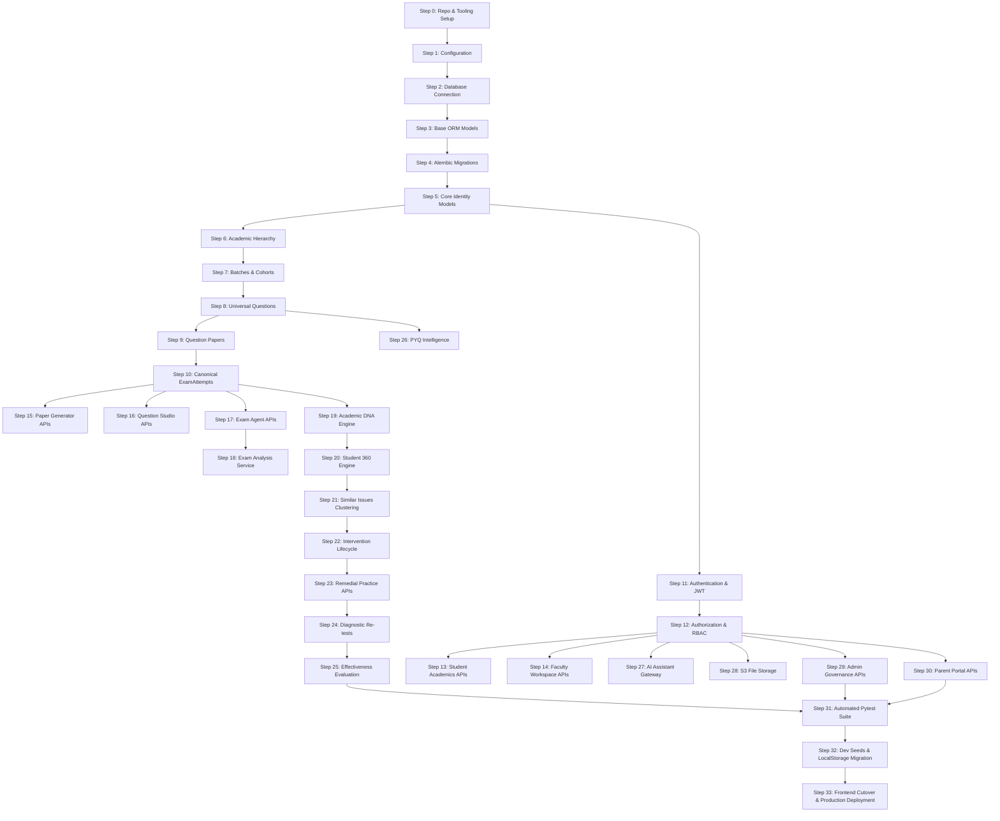

# 11 — BACKEND IMPLEMENTATION ORDER & ROADMAP

**Project:** MediXO EduX (`medixo-edux-platform` v1.0.0)
**Phase:** E — Python Backend Implementation Blueprint
**Date:** 2026-08-23 · **Branch:** `arena/01a02f45-edux`
**Status:** Complete & Verified Implementation Roadmap

---

## 1. IMPLEMENTATION PRINCIPLES & DEPENDENCY ORDERING

The Python backend implementation sequence is strictly dictated by data and architectural dependencies discovered during Phases A through D. A downstream feature (e.g. Student 360 or Intervention Effectiveness) CANNOT be implemented before its underlying data contracts (ExamAttempt, QuestionAttempt) and security boundaries (RBAC, Tenancy) are fully established.

---

## 2. IMPLEMENTATION DEPENDENCY GRAPH

---

## 3. STEP-BY-STEP IMPLEMENTATION ROADMAP (STEPS 0 TO 33)

### Step 0: Repository & Tooling Foundation
- **Description:** Initialize `backend/` package, `pyproject.toml` (Poetry/UV), FastAPI, Uvicorn, pre-commit hooks, Ruff linter/formatter.
- **Verification Criteria:** Corresponding pytest test suite passes and response matches Phase B contract.

### Step 1: Configuration & Environment Architecture
- **Description:** Implement `app/core/config.py` using `pydantic-settings` BaseSettings, environment variable loading, and CORS settings.
- **Verification Criteria:** Corresponding pytest test suite passes and response matches Phase B contract.

### Step 2: Async Database Connection
- **Description:** Implement `app/core/database.py` with SQLAlchemy 2.0 `create_async_engine`, async sessionmaker, and connection health checks.
- **Verification Criteria:** Corresponding pytest test suite passes and response matches Phase B contract.

### Step 3: Base SQLAlchemy Models & Mixins
- **Description:** Implement `app/models/base.py` with `DeclarativeBase`, UUID primary key mixin, and ISO timestamp mixin.
- **Verification Criteria:** Corresponding pytest test suite passes and response matches Phase B contract.

### Step 4: Alembic Async Migration Setup
- **Description:** Configure `alembic.ini` and `alembic/env.py` for async migrations and generate initial baseline revision.
- **Verification Criteria:** Corresponding pytest test suite passes and response matches Phase B contract.

### Step 5: Core Identity Models
- **Description:** Implement `UserModel`, `StudentModel`, `FacultyModel`, `AdminProfileModel`, and `ParentModel` with bcrypt password hashing.
- **Verification Criteria:** Corresponding pytest test suite passes and response matches Phase B contract.

### Step 6: Institution & Academic Hierarchy Models
- **Description:** Implement `InstitutionModel`, `DepartmentModel`, `ProgramModel`, `CourseModel`, `SubjectModel`, `ChapterModel`, `TopicModel`, `ConceptModel`.
- **Verification Criteria:** Corresponding pytest test suite passes and response matches Phase B contract.

### Step 7: Batches & Cohort Membership
- **Description:** Implement `BatchModel` and student enrollment foreign keys; enforce batch-student 1:N relationship.
- **Verification Criteria:** Corresponding pytest test suite passes and response matches Phase B contract.

### Step 8: Universal Question & Source Models
- **Description:** Implement `QuestionModel`, `QuestionSourceModel`, and `QuestionStudioSessionModel` supporting both MCQ and Subjective schemas.
- **Verification Criteria:** Corresponding pytest test suite passes and response matches Phase B contract.

### Step 9: Question Paper & Sharing Models
- **Description:** Implement `QuestionPaperModel`, `PaperQuestionJunction`, and `PaperShareModel` with title uniqueness validation.
- **Verification Criteria:** Corresponding pytest test suite passes and response matches Phase B contract.

### Step 10: Canonical ExamAttempt & QuestionAttempt
- **Description:** Implement `ExamAttemptModel` and child `QuestionAttemptModel` with strict `(domain, exam_family)` isolation constraints.
- **Verification Criteria:** Corresponding pytest test suite passes and response matches Phase B contract.

### Step 11: Authentication & Token Security
- **Description:** Implement `AuthService` (`app/services/auth_service.py`) with bcrypt password verification, JWT issuance, and OTP verification.
- **Verification Criteria:** Corresponding pytest test suite passes and response matches Phase B contract.

### Step 12: Authorization & RBAC Middleware
- **Description:** Implement `app/core/dependencies.py` with `get_current_user`, `require_role`, and tenant isolation filter injection.
- **Verification Criteria:** Corresponding pytest test suite passes and response matches Phase B contract.

### Step 13: Student Academics & Portal APIs
- **Description:** Implement `app/api/v1/student/academics.py` (9 endpoints matching Phase B contracts).
- **Verification Criteria:** Corresponding pytest test suite passes and response matches Phase B contract.

### Step 14: Faculty Workspace & Teaching APIs
- **Description:** Implement `app/api/v1/faculty/workspace.py` (13 endpoints matching Phase B contracts).
- **Verification Criteria:** Corresponding pytest test suite passes and response matches Phase B contract.

### Step 15: Question Paper Generator APIs
- **Description:** Implement `app/api/v1/faculty/papers.py` (7 endpoints: create, duplicate, regenerate, archive, delete, share).
- **Verification Criteria:** Corresponding pytest test suite passes and response matches Phase B contract.

### Step 16: Question Studio & Content Intelligence APIs
- **Description:** Implement `app/api/v1/faculty/question_studio.py` (12 endpoints: sources, analyze, upload, generate, sessions, actions).
- **Verification Criteria:** Corresponding pytest test suite passes and response matches Phase B contract.

### Step 17: Exam Agent Assessment Delivery APIs
- **Description:** Implement `app/api/v1/student/exam_agent.py` (4 endpoints: exams, attempt history, single attempt, submit).
- **Verification Criteria:** Corresponding pytest test suite passes and response matches Phase B contract.

### Step 18: AI Exam Analysis Service & APIs
- **Description:** Implement `app/api/v1/student/exam_analysis.py` and `app/intelligence/exam_attempt_intelligence.py`.
- **Verification Criteria:** Corresponding pytest test suite passes and response matches Phase B contract.

### Step 19: Academic DNA Engine & Signals APIs
- **Description:** Implement `app/api/v1/student/intelligence.py` and `app/intelligence/dna.py` with separate University, JEE, and NEET pools.
- **Verification Criteria:** Corresponding pytest test suite passes and response matches Phase B contract.

### Step 20: Student 360 Diagnostic Engine & APIs
- **Description:** Implement `app/api/v1/faculty/student_360.py` and `app/intelligence/student_360.py` (composite on-demand derivation).
- **Verification Criteria:** Corresponding pytest test suite passes and response matches Phase B contract.

### Step 21: Similar Issues Clustering Engine & APIs
- **Description:** Implement `app/api/v1/faculty/similar_issues.py` and `app/intelligence/similar_issues.py` with domain/examFamily partition.
- **Verification Criteria:** Corresponding pytest test suite passes and response matches Phase B contract.

### Step 22: Intervention Lifecycle Service & APIs
- **Description:** Implement `app/api/v1/faculty/interventions.py` and `app/services/intervention_service.py` enforcing 9-state machine.
- **Verification Criteria:** Corresponding pytest test suite passes and response matches Phase B contract.

### Step 23: Remedial Practice Delivery & Submission APIs
- **Description:** Implement `app/api/v1/student/interventions.py` for practice test delivery and practice attempt submission.
- **Verification Criteria:** Corresponding pytest test suite passes and response matches Phase B contract.

### Step 24: Diagnostic Re-tests Service & APIs
- **Description:** Implement diagnostic re-test scheduling (`POST .../retest`) and student re-test paper delivery.
- **Verification Criteria:** Corresponding pytest test suite passes and response matches Phase B contract.

### Step 25: Effectiveness Evaluation Engine & APIs
- **Description:** Implement `app/intelligence/intervention_lifecycle.py` calculating mathematical accuracy/time deltas.
- **Verification Criteria:** Corresponding pytest test suite passes and response matches Phase B contract.

### Step 26: PYQ Intelligence & Pattern Analytics APIs
- **Description:** Implement `app/api/v1/faculty/pyq.py` and `app/intelligence/pyq_intelligence.py`.
- **Verification Criteria:** Corresponding pytest test suite passes and response matches Phase B contract.

### Step 27: AI Assistant Gateway Services & APIs
- **Description:** Implement `app/api/v1/ai/assistants.py` and `app/services/ai_service.py` (AI Tutor, Teaching Assistant, Copilot).
- **Verification Criteria:** Corresponding pytest test suite passes and response matches Phase B contract.

### Step 28: File & Document Storage Service
- **Description:** Implement `app/services/document_service.py` with multipart upload validation, S3 storage, and pre-signed URLs.
- **Verification Criteria:** Corresponding pytest test suite passes and response matches Phase B contract.

### Step 29: Administration & Governance APIs
- **Description:** Implement `app/api/v1/admin/administration.py` (19 endpoints) and `app/api/v1/admin/people.py` (2 endpoints).
- **Verification Criteria:** Corresponding pytest test suite passes and response matches Phase B contract.

### Step 30: Parent Portal APIs
- **Description:** Implement `app/api/v1/parent/routes.py` (17 endpoints) enforcing verified `parent_students` link.
- **Verification Criteria:** Corresponding pytest test suite passes and response matches Phase B contract.

### Step 31: Comprehensive Pytest Test Suite
- **Description:** Execute unit, integration, API contract, and security test suites verifying 100% parity with Phase B.
- **Verification Criteria:** Corresponding pytest test suite passes and response matches Phase B contract.

### Step 32: Dev Seeds & LocalStorage Migration
- **Description:** Implement `scripts/seed_dev_data.py` and `scripts/migrate_localstorage.py` (importing prototype records).
- **Verification Criteria:** Corresponding pytest test suite passes and response matches Phase B contract.

### Step 33: Frontend Cutover & Production Deployment
- **Description:** Switch `VITE_USE_MOCK=false` in frontend, build production Docker image, deploy behind Nginx, verify end-to-end.
- **Verification Criteria:** Corresponding pytest test suite passes and response matches Phase B contract.

---

## 4. CRITICAL PATH ANALYSIS

The implementation critical path runs through 7 bottleneck milestones:
$$\text{Step 2 (DB Connection)} \rightarrow \text{Step 5 (Identity)} \rightarrow \text{Step 8 (Questions)} \rightarrow \text{Step 10 (ExamAttempts)} \rightarrow \text{Step 19 (Academic DNA)} \rightarrow \text{Step 22 (Interventions)} \rightarrow \text{Step 33 (Cutover)}$$

---

## CONCLUSION
This roadmap defines the unambiguous, step-by-step sequence for constructing the Python backend, ensuring all architectural invariants and security constraints are satisfied in exact order.